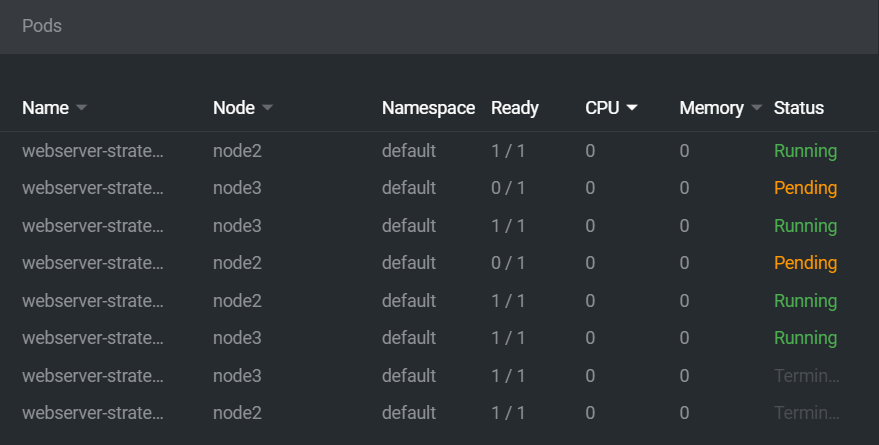
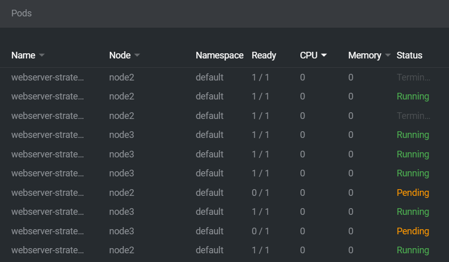
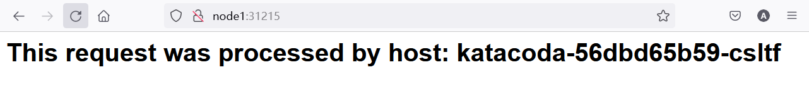

# K8S群集的安装


## 手动安装


## 使用 sealyun 快速安装


## 使用在线沙盒


# 解析Pod


克隆实验脚本

```bash
git clone https://github.com/cloudzun/k8slab/

cd k8slab/

git branch -a

git checkout v1.23
```


## Lab 1 极简创建 pod


使用命令行创建pod，注意两个必须的属性名称和映像

```bash
kubectl run nginx --image=nginx
```


查看pod

```bash
kubectl get pods
```


```bash
root@node1:~/k8slab# kubectl get pods
NAME    READY   STATUS    RESTARTS   AGE
nginx   1/1     Running   0          97s
```


观测其他属性，比如 ip 地址，所在节点

```bash
kubectl get pods -o wide 
```


```bash
NAME    READY   STATUS    RESTARTS   AGE    IP             NODE    NOMINATED NODE   READINESS GATES
nginx   1/1     Running   0          116s   10.244.135.2   node3   <none>           <none>
```


删除现有 pod，准备另起炉灶

```bash
kubectl delete pod nginx
```


```bash
root@node1:~/k8slab# kubectl delete pod nginx
pod "nginx" deleted
```


查看 yaml 样例

```bash
kubectl run nginx --image=nginx --dry-run=client -o yaml
```


```yaml
apiVersion: v1
kind: Pod
metadata:
  creationTimestamp: null
  labels:
    run: nginx
  name: nginx
spec:
  containers:
  - image: nginx
    name: nginx
    resources: {}
  dnsPolicy: ClusterFirst
  restartPolicy: Always
status: {}
```


查看 kind 定义

```bash
kubectl api-resources
```


```bash
root@node1:~/k8slab# kubectl api-resources
NAME                              SHORTNAMES   APIVERSION                             NAMESPACED   KIND
bindings                                       v1                                     true         Binding
componentstatuses                 cs           v1                                     false        ComponentStatus
configmaps                        cm           v1                                     true         ConfigMap
endpoints                         ep           v1                                     true         Endpoints
events                            ev           v1                                     true         Event
limitranges                       limits       v1                                     true         LimitRange
namespaces                        ns           v1                                     false        Namespace
nodes                             no           v1                                     false        Node
persistentvolumeclaims            pvc          v1                                     true         PersistentVolumeClaim
persistentvolumes                 pv           v1                                     false        PersistentVolume
pods                              po           v1                                     true         Pod
podtemplates                                   v1                                     true         PodTemplate
replicationcontrollers            rc           v1                                     true         ReplicationController
resourcequotas                    quota        v1                                     true         ResourceQuota
secrets                                        v1                                     true         Secret
serviceaccounts                   sa           v1                                     true         ServiceAccount
services                          svc          v1                                     true         Service
mutatingwebhookconfigurations                  admissionregistration.k8s.io/v1        false        MutatingWebhookConfiguration
validatingwebhookconfigurations                admissionregistration.k8s.io/v1        false        ValidatingWebhookConfiguration
customresourcedefinitions         crd,crds     apiextensions.k8s.io/v1                false        CustomResourceDefinition
apiservices                                    apiregistration.k8s.io/v1              false        APIService
controllerrevisions                            apps/v1                                true         ControllerRevision
daemonsets                        ds           apps/v1                                true         DaemonSet
deployments                       deploy       apps/v1                                true         Deployment
replicasets                       rs           apps/v1                                true         ReplicaSet
statefulsets                      sts          apps/v1                                true         StatefulSet
tokenreviews                                   authentication.k8s.io/v1               false        TokenReview
localsubjectaccessreviews                      authorization.k8s.io/v1                true         LocalSubjectAccessReview
selfsubjectaccessreviews                       authorization.k8s.io/v1                false        SelfSubjectAccessReview
selfsubjectrulesreviews                        authorization.k8s.io/v1                false        SelfSubjectRulesReview
subjectaccessreviews                           authorization.k8s.io/v1                false        SubjectAccessReview
horizontalpodautoscalers          hpa          autoscaling/v2                         true         HorizontalPodAutoscaler
cronjobs                          cj           batch/v1                               true         CronJob
jobs                                           batch/v1                               true         Job
certificatesigningrequests        csr          certificates.k8s.io/v1                 false        CertificateSigningRequest
leases                                         coordination.k8s.io/v1                 true         Lease
bgpconfigurations                              crd.projectcalico.org/v1               false        BGPConfiguration
bgppeers                                       crd.projectcalico.org/v1               false        BGPPeer
blockaffinities                                crd.projectcalico.org/v1               false        BlockAffinity
caliconodestatuses                             crd.projectcalico.org/v1               false        CalicoNodeStatus
clusterinformations                            crd.projectcalico.org/v1               false        ClusterInformation
felixconfigurations                            crd.projectcalico.org/v1               false        FelixConfiguration
globalnetworkpolicies                          crd.projectcalico.org/v1               false        GlobalNetworkPolicy
globalnetworksets                              crd.projectcalico.org/v1               false        GlobalNetworkSet
hostendpoints                                  crd.projectcalico.org/v1               false        HostEndpoint
ipamblocks                                     crd.projectcalico.org/v1               false        IPAMBlock
ipamconfigs                                    crd.projectcalico.org/v1               false        IPAMConfig
ipamhandles                                    crd.projectcalico.org/v1               false        IPAMHandle
ippools                                        crd.projectcalico.org/v1               false        IPPool
ipreservations                                 crd.projectcalico.org/v1               false        IPReservation
kubecontrollersconfigurations                  crd.projectcalico.org/v1               false        KubeControllersConfiguration
networkpolicies                                crd.projectcalico.org/v1               true         NetworkPolicy
networksets                                    crd.projectcalico.org/v1               true         NetworkSet
endpointslices                                 discovery.k8s.io/v1                    true         EndpointSlice
events                            ev           events.k8s.io/v1                       true         Event
flowschemas                                    flowcontrol.apiserver.k8s.io/v1beta2   false        FlowSchema
prioritylevelconfigurations                    flowcontrol.apiserver.k8s.io/v1beta2   false        PriorityLevelConfiguration
ingressclasses                                 networking.k8s.io/v1                   false        IngressClass
ingresses                         ing          networking.k8s.io/v1                   true         Ingress
networkpolicies                   netpol       networking.k8s.io/v1                   true         NetworkPolicy
runtimeclasses                                 node.k8s.io/v1                         false        RuntimeClass
poddisruptionbudgets              pdb          policy/v1                              true         PodDisruptionBudget
podsecuritypolicies               psp          policy/v1beta1                         false        PodSecurityPolicy
clusterrolebindings                            rbac.authorization.k8s.io/v1           false        ClusterRoleBinding
clusterroles                                   rbac.authorization.k8s.io/v1           false        ClusterRole
rolebindings                                   rbac.authorization.k8s.io/v1           true         RoleBinding
roles                                          rbac.authorization.k8s.io/v1           true         Role
priorityclasses                   pc           scheduling.k8s.io/v1                   false        PriorityClass
csidrivers                                     storage.k8s.io/v1                      false        CSIDriver
csinodes                                       storage.k8s.io/v1                      false        CSINode
csistoragecapacities                           storage.k8s.io/v1beta1                 true         CSIStorageCapacity
storageclasses                    sc           storage.k8s.io/v1                      false        StorageClass
volumeattachments                              storage.k8s.io/v1                      false        VolumeAttachment
```


查看 version 定义

```bash
kubectl explain pods
```


```bash
root@node1:~/k8slab# kubectl explain pods
KIND:     Pod
VERSION:  v1

DESCRIPTION:
     Pod is a collection of containers that can run on a host. This resource is
     created by clients and scheduled onto hosts.

FIELDS:
   apiVersion   <string>
     APIVersion defines the versioned schema of this representation of an
     object. Servers should convert recognized schemas to the latest internal
     value, and may reject unrecognized values. More info:
     https://git.k8s.io/community/contributors/devel/sig-architecture/api-conventions.md#resources

   kind <string>
     Kind is a string value representing the REST resource this object
     represents. Servers may infer this from the endpoint the client submits
     requests to. Cannot be updated. In CamelCase. More info:
     https://git.k8s.io/community/contributors/devel/sig-architecture/api-conventions.md#types-kinds

   metadata     <Object>
     Standard object's metadata. More info:
     https://git.k8s.io/community/contributors/devel/sig-architecture/api-conventions.md#metadata

   spec <Object>
     Specification of the desired behavior of the pod. More info:
     https://git.k8s.io/community/contributors/devel/sig-architecture/api-conventions.md#spec-and-status

   status       <Object>
     Most recently observed status of the pod. This data may not be up to date.
     Populated by the system. Read-only. More info:
     https://git.k8s.io/community/contributors/devel/sig-architecture/api-conventions.md#spec-and-status
```


创建yaml文件，使用最简配置

```bash
nano nginx.yaml
```


```yaml
apiVersion: v1
kind: Pod
metadata:
  name: nginx
spec:
  containers:
  - name: nginx
    image: nginx
```


创建pod

```bash
kubectl apply -f nginx.yaml
```


查看pod

```bash
kubectl get pod -o wide
```


```bash
root@node1:~/k8slab/pod# kubectl get pod -o wide
NAME    READY   STATUS    RESTARTS   AGE   IP             NODE    NOMINATED NODE   READINESS GATES
nginx   1/1     Running   0          92s   10.244.135.3   node3   <none>           <none>
```


使用pod ip地址访问pod

```bash
curl 10.244.135.3 
```


```bash
root@node1:~/k8slab/pod# curl 10.244.135.3
<!DOCTYPE html>
<html>
<head>
<title>Welcome to nginx!</title>
<style>
html { color-scheme: light dark; }
body { width: 35em; margin: 0 auto;
font-family: Tahoma, Verdana, Arial, sans-serif; }
</style>
</head>
<body>
<h1>Welcome to nginx!</h1>
<p>If you see this page, the nginx web server is successfully installed and
working. Further configuration is required.</p>

<p>For online documentation and support please refer to
<a href="http://nginx.org/">nginx.org</a>.<br/>
Commercial support is available at
<a href="http://nginx.com/">nginx.com</a>.</p>

<p><em>Thank you for using nginx.</em></p>
</body>
</html>
```


查看 pod 详细信息,分段查看重点字段内容

```bash
kubectl describe pod nginx
```


```bash
root@node1:~/k8slab/pod# kubectl describe pod nginx
Name:         nginx
Namespace:    default
Priority:     0
Node:         node3/192.168.1.233
Start Time:   Wed, 21 Dec 2022 09:31:18 +0800
Labels:       <none>
Annotations:  cni.projectcalico.org/containerID: 7f025169ec66a6ef670d4fd85f624e8e075ea8b69617241e42451f901afa6f5f
              cni.projectcalico.org/podIP: 10.244.135.3/32
              cni.projectcalico.org/podIPs: 10.244.135.3/32
Status:       Running
IP:           10.244.135.3
IPs:
  IP:  10.244.135.3
Containers:
  nginx:
    Container ID:   docker://c59e02a1d5109f634fe979319deb390d752d167714bed390929bdec8db302462
    Image:          nginx
    Image ID:       docker-pullable://nginx@sha256:0d17b565c37bcbd895e9d92315a05c1c3c9a29f762b011a10c54a66cd53c9b31
    Port:           <none>
    Host Port:      <none>
    State:          Running
      Started:      Wed, 21 Dec 2022 09:31:34 +0800
    Ready:          True
    Restart Count:  0
    Environment:    <none>
    Mounts:
      /var/run/secrets/kubernetes.io/serviceaccount from kube-api-access-wbl6x (ro)
Conditions:
  Type              Status
  Initialized       True
  Ready             True
  ContainersReady   True
  PodScheduled      True
Volumes:
  kube-api-access-wbl6x:
    Type:                    Projected (a volume that contains injected data from multiple sources)
    TokenExpirationSeconds:  3607
    ConfigMapName:           kube-root-ca.crt
    ConfigMapOptional:       <nil>
    DownwardAPI:             true
QoS Class:                   BestEffort
Node-Selectors:              <none>
Tolerations:                 node.kubernetes.io/not-ready:NoExecute op=Exists for 300s
                             node.kubernetes.io/unreachable:NoExecute op=Exists for 300s
Events:
  Type    Reason     Age    From               Message
  ----    ------     ----   ----               -------
  Normal  Scheduled  3m41s  default-scheduler  Successfully assigned default/nginx to node3
  Normal  Pulling    3m41s  kubelet            Pulling image "nginx"
  Normal  Pulled     3m26s  kubelet            Successfully pulled image "nginx" in 15.296929104s
  Normal  Created    3m26s  kubelet            Created container nginx
  Normal  Started    3m26s  kubelet            Started container nginx
```


查看pod yaml文件

```bash
kubectl get pods -o yaml
```


```bash
root@node1:~/k8slab/pod# kubectl get pods -o yaml
apiVersion: v1
items:
- apiVersion: v1
  kind: Pod
  metadata:
    annotations:
      cni.projectcalico.org/containerID: 7f025169ec66a6ef670d4fd85f624e8e075ea8b69617241e42451f901afa6f5f
      cni.projectcalico.org/podIP: 10.244.135.3/32
      cni.projectcalico.org/podIPs: 10.244.135.3/32
      kubectl.kubernetes.io/last-applied-configuration: |
        {"apiVersion":"v1","kind":"Pod","metadata":{"annotations":{},"name":"nginx","namespace":"default"},"spec":{"containers":[{"image":"nginx","name":"nginx"}]}}
    creationTimestamp: "2022-12-21T01:31:18Z"
    name: nginx
    namespace: default
    resourceVersion: "3940"
    uid: eba4b72c-0fc8-41ec-a86b-c5b183668801
  spec:
    containers:
    - image: nginx
      imagePullPolicy: Always
      name: nginx
      resources: {}
      terminationMessagePath: /dev/termination-log
      terminationMessagePolicy: File
      volumeMounts:
      - mountPath: /var/run/secrets/kubernetes.io/serviceaccount
        name: kube-api-access-wbl6x
        readOnly: true
    dnsPolicy: ClusterFirst
    enableServiceLinks: true
    nodeName: node3
    preemptionPolicy: PreemptLowerPriority
    priority: 0
    restartPolicy: Always
    schedulerName: default-scheduler
    securityContext: {}
    serviceAccount: default
    serviceAccountName: default
    terminationGracePeriodSeconds: 30
    tolerations:
    - effect: NoExecute
      key: node.kubernetes.io/not-ready
      operator: Exists
      tolerationSeconds: 300
    - effect: NoExecute
      key: node.kubernetes.io/unreachable
      operator: Exists
      tolerationSeconds: 300
    volumes:
    - name: kube-api-access-wbl6x
      projected:
        defaultMode: 420
        sources:
        - serviceAccountToken:
            expirationSeconds: 3607
            path: token
        - configMap:
            items:
            - key: ca.crt
              path: ca.crt
            name: kube-root-ca.crt
        - downwardAPI:
            items:
            - fieldRef:
                apiVersion: v1
                fieldPath: metadata.namespace
              path: namespace
  status:
    conditions:
    - lastProbeTime: null
      lastTransitionTime: "2022-12-21T01:31:18Z"
      status: "True"
      type: Initialized
    - lastProbeTime: null
      lastTransitionTime: "2022-12-21T01:31:34Z"
      status: "True"
      type: Ready
    - lastProbeTime: null
      lastTransitionTime: "2022-12-21T01:31:34Z"
      status: "True"
      type: ContainersReady
    - lastProbeTime: null
      lastTransitionTime: "2022-12-21T01:31:18Z"
      status: "True"
      type: PodScheduled
    containerStatuses:
    - containerID: docker://c59e02a1d5109f634fe979319deb390d752d167714bed390929bdec8db302462
      image: nginx:latest
      imageID: docker-pullable://nginx@sha256:0d17b565c37bcbd895e9d92315a05c1c3c9a29f762b011a10c54a66cd53c9b31
      lastState: {}
      name: nginx
      ready: true
      restartCount: 0
      started: true
      state:
        running:
          startedAt: "2022-12-21T01:31:34Z"
    hostIP: 192.168.1.233
    phase: Running
    podIP: 10.244.135.3
    podIPs:
    - ip: 10.244.135.3
    qosClass: BestEffort
    startTime: "2022-12-21T01:31:18Z"
kind: List
metadata:
  resourceVersion: ""
  selfLink: ""
```


进入pod中的容器（亦可使用/bin/sh）

```bash
kubectl exec -it nginx -- /bin/bash
```


```bash
root@node1:~/k8slab/pod# kubectl exec -it nginx -- /bin/bash
root@nginx:/#
```


在容器上下文里查看DNS地址

```bash
cat /etc/resolv.conf 
```


```bash
root@nginx:/# cat /etc/resolv.conf
nameserver 10.96.0.10
search default.svc.cluster.local svc.cluster.local cluster.local
options ndots:5
```


退出容器上下文

```bash
exit
```


```bash
root@nginx:/# exit
exit
root@node1:~/k8slab/pod#
```


查看pod日志

```bash
kubectl logs nginx
```


```bash
root@node1:~/k8slab/pod# kubectl logs nginx
/docker-entrypoint.sh: /docker-entrypoint.d/ is not empty, will attempt to perform configuration
/docker-entrypoint.sh: Looking for shell scripts in /docker-entrypoint.d/
/docker-entrypoint.sh: Launching /docker-entrypoint.d/10-listen-on-ipv6-by-default.sh
10-listen-on-ipv6-by-default.sh: info: Getting the checksum of /etc/nginx/conf.d/default.conf
10-listen-on-ipv6-by-default.sh: info: Enabled listen on IPv6 in /etc/nginx/conf.d/default.conf
/docker-entrypoint.sh: Launching /docker-entrypoint.d/20-envsubst-on-templates.sh
/docker-entrypoint.sh: Launching /docker-entrypoint.d/30-tune-worker-processes.sh
/docker-entrypoint.sh: Configuration complete; ready for start up
2022/12/21 01:31:34 [notice] 1#1: using the "epoll" event method
2022/12/21 01:31:34 [notice] 1#1: nginx/1.21.5
2022/12/21 01:31:34 [notice] 1#1: built by gcc 10.2.1 20210110 (Debian 10.2.1-6)
2022/12/21 01:31:34 [notice] 1#1: OS: Linux 5.4.0-107-generic
2022/12/21 01:31:34 [notice] 1#1: getrlimit(RLIMIT_NOFILE): 1048576:1048576
2022/12/21 01:31:34 [notice] 1#1: start worker processes
2022/12/21 01:31:34 [notice] 1#1: start worker process 32
2022/12/21 01:31:34 [notice] 1#1: start worker process 33
2022/12/21 01:31:34 [notice] 1#1: start worker process 34
2022/12/21 01:31:34 [notice] 1#1: start worker process 35
10.244.166.128 - - [21/Dec/2022:01:34:09 +0000] "GET / HTTP/1.1" 200 615 "-" "curl/7.68.0" "-"
```


加参数查看滚动日志,因为没有活动部分,所以暂时看不到日志滚动

```bash
kubectl  logs -f  nginx
```


## Lab 2 创建多容器 pod


使用示例文件创建yaml文件

```bash
nano many-pods.yaml
```


```yaml
apiVersion: v1
kind: Pod
metadata:
  name: many-pods
spec:
  containers:
  - name: nginx
    image: nginx
  - name: redis # 多容器
    image: redis
  - name: memcached # 多容器
    image: memcached
```


创建pod

```bash
kubectl apply -f many-pods.yaml
```


查看pod

```bash
kubectl get pods
```


```bash
root@node1:~/k8slab/pod# kubectl get pods
NAME        READY   STATUS    RESTARTS   AGE
many-pods   3/3     Running   0          77s
nginx       1/1     Running   0          19m
```


查看pod详细信息

```bash
kubectl describe pod many-pods
```


```bash
root@node1:~/k8slab/pod# kubectl describe pod many-pods
Name:         many-pods
Namespace:    default
Priority:     0
Node:         node2/192.168.1.232
Start Time:   Wed, 21 Dec 2022 09:49:38 +0800
Labels:       <none>
Annotations:  cni.projectcalico.org/containerID: cb6fcbd0725be62e5aca863637a2a369a111e74e651e95f68ad2aa26edfca8d9
              cni.projectcalico.org/podIP: 10.244.104.3/32
              cni.projectcalico.org/podIPs: 10.244.104.3/32
Status:       Running
IP:           10.244.104.3
IPs:
  IP:  10.244.104.3
Containers:
  nginx:
    Container ID:   docker://a8f1b238fa227303c0776cf075e353cf119c9d95f50f1df514747bc32d318857
    Image:          nginx
    Image ID:       docker-pullable://nginx@sha256:0d17b565c37bcbd895e9d92315a05c1c3c9a29f762b011a10c54a66cd53c9b31
    Port:           <none>
    Host Port:      <none>
    State:          Running
      Started:      Wed, 21 Dec 2022 09:49:47 +0800
    Ready:          True
    Restart Count:  0
    Environment:    <none>
    Mounts:
      /var/run/secrets/kubernetes.io/serviceaccount from kube-api-access-t7jvl (ro)
  redis:
    Container ID:   docker://1c0e8225f660bfb476e0de742d1e26571288252f34907cf7a4782f487e5d0d5c
    Image:          redis
    Image ID:       docker-pullable://redis@sha256:db485f2e245b5b3329fdc7eff4eb00f913e09d8feb9ca720788059fdc2ed8339
    Port:           <none>
    Host Port:      <none>
    State:          Running
      Started:      Wed, 21 Dec 2022 09:50:05 +0800
    Ready:          True
    Restart Count:  0
    Environment:    <none>
    Mounts:
      /var/run/secrets/kubernetes.io/serviceaccount from kube-api-access-t7jvl (ro)
  memcached:
    Container ID:   docker://59551cfbc50dbcc09a67bbd61ed6faf04b5654bec3dee36ad923d355ad3e41fa
    Image:          memcached
    Image ID:       docker-pullable://memcached@sha256:a7895a53299404c294de9d8b0627c2585e924c389783f77c30df0cf6a316750c
    Port:           <none>
    Host Port:      <none>
    State:          Running
      Started:      Wed, 21 Dec 2022 09:50:07 +0800
    Ready:          True
    Restart Count:  0
    Environment:    <none>
    Mounts:
      /var/run/secrets/kubernetes.io/serviceaccount from kube-api-access-t7jvl (ro)
Conditions:
  Type              Status
  Initialized       True
  Ready             True
  ContainersReady   True
  PodScheduled      True
Volumes:
  kube-api-access-t7jvl:
    Type:                    Projected (a volume that contains injected data from multiple sources)
    TokenExpirationSeconds:  3607
    ConfigMapName:           kube-root-ca.crt
    ConfigMapOptional:       <nil>
    DownwardAPI:             true
QoS Class:                   BestEffort
Node-Selectors:              <none>
Tolerations:                 node.kubernetes.io/not-ready:NoExecute op=Exists for 300s
                             node.kubernetes.io/unreachable:NoExecute op=Exists for 300s
Events:
  Type    Reason     Age    From               Message
  ----    ------     ----   ----               -------
  Normal  Scheduled  4m18s  default-scheduler  Successfully assigned default/many-pods to node2
  Normal  Pulling    4m17s  kubelet            Pulling image "nginx"
  Normal  Pulled     4m9s   kubelet            Successfully pulled image "nginx" in 7.743984739s
  Normal  Created    4m9s   kubelet            Created container nginx
  Normal  Started    4m9s   kubelet            Started container nginx
  Normal  Pulling    4m9s   kubelet            Pulling image "redis"
  Normal  Pulled     3m51s  kubelet            Successfully pulled image "redis" in 17.374983329s
  Normal  Created    3m51s  kubelet            Created container redis
  Normal  Started    3m51s  kubelet            Started container redis
  Normal  Pulling    3m51s  kubelet            Pulling image "memcached"
  Normal  Pulled     3m49s  kubelet            Successfully pulled image "memcached" in 1.700556634s
  Normal  Created    3m49s  kubelet            Created container memcached
  Normal  Started    3m49s  kubelet            Started container memcached
```


进入pod中的容器

```bash
kubectl exec -it many-pods -- /bin/bash
```


```bash
root@node1:~/k8slab/pod# kubectl exec -it many-pods -- /bin/bash
Defaulted container "nginx" out of: nginx, redis, memcached
root@many-pods:/#
```

因为没有指定容器名字，因此进入的是第一个容器


退出nginx容器上下文

```text
exit
```


加-c参数进入redis容器

```bash
kubectl exec -it many-pods -c redis -- /bin/bash
```


在redis容器上下文执行redis-cli

```bash
redis-cli
```


退出redis容器上下文，需执行两次

```bash
exit
```


```bash
root@node1:~/k8slab/pod# kubectl exec -it many-pods -c redis -- /bin/bash
root@many-pods:/data# redis-cli
127.0.0.1:6379> exit
root@many-pods:/data# exit
exit
```


加-c参数进入memcached容器

```bash
kubectl exec -it many-pods -c memcached -- /bin/bash
```


在memcached容器上下文执行命令

```bash
memcached --help
```


```bash
root@node1:~/k8slab/pod# kubectl exec -it many-pods -c memcached -- /bin/bash
memcache@many-pods:/$ memcached --help
memcached 1.6.12
-p, --port=<num>          TCP port to listen on (default: 11211)
-U, --udp-port=<num>      UDP port to listen on (default: 0, off)
-s, --unix-socket=<file>  UNIX socket to listen on (disables network support)
-a, --unix-mask=<mask>    access mask for UNIX socket, in octal (default: 700)
-A, --enable-shutdown     enable ascii "shutdown" command
-l, --listen=<addr>       interface to listen on (default: INADDR_ANY)
                          if TLS/SSL is enabled, 'notls' prefix can be used to
                          disable for specific listeners (-l notls:<ip>:<port>)
-d, --daemon              run as a daemon
-r, --enable-coredumps    maximize core file limit
-u, --user=<user>         assume identity of <username> (only when run as root)
-m, --memory-limit=<num>  item memory in megabytes (default: 64)
-M, --disable-evictions   return error on memory exhausted instead of evicting
-c, --conn-limit=<num>    max simultaneous connections (default: 1024)
-k, --lock-memory         lock down all paged memory
-v, --verbose             verbose (print errors/warnings while in event loop)
-vv                       very verbose (also print client commands/responses)
-vvv                      extremely verbose (internal state transitions)
-h, --help                print this help and exit
-i, --license             print memcached and libevent license
-V, --version             print version and exit
-P, --pidfile=<file>      save PID in <file>, only used with -d option
-f, --slab-growth-factor=<num> chunk size growth factor (default: 1.25)
-n, --slab-min-size=<bytes> min space used for key+value+flags (default: 48)
-L, --enable-largepages  try to use large memory pages (if available)
-D <char>     Use <char> as the delimiter between key prefixes and IDs.
              This is used for per-prefix stats reporting. The default is
              ":" (colon). If this option is specified, stats collection
              is turned on automatically; if not, then it may be turned on
              by sending the "stats detail on" command to the server.
-t, --threads=<num>       number of threads to use (default: 4)
-R, --max-reqs-per-event  maximum number of requests per event, limits the
                          requests processed per connection to prevent
                          starvation (default: 20)
-C, --disable-cas         disable use of CAS
-b, --listen-backlog=<num> set the backlog queue limit (default: 1024)
-B, --protocol=<name>     protocol - one of ascii, binary, or auto (default: auto-negotiate)
-I, --max-item-size=<num> adjusts max item size
                          (default: 1m, min: 1k, max: 1024m)
-S, --enable-sasl         turn on Sasl authentication
-F, --disable-flush-all   disable flush_all command
-X, --disable-dumping     disable stats cachedump and lru_crawler metadump
-W  --disable-watch       disable watch commands (live logging)
-Y, --auth-file=<file>    (EXPERIMENTAL) enable ASCII protocol authentication. format:
                          user:pass\nuser2:pass2\n
-e, --memory-file=<file>  (EXPERIMENTAL) mmap a file for item memory.
                          use only in ram disks or persistent memory mounts!
                          enables restartable cache (stop with SIGUSR1)
-Z, --enable-ssl          enable TLS/SSL
-o, --extended            comma separated list of extended options
                          most options have a 'no_' prefix to disable
   - maxconns_fast:       immediately close new connections after limit (default: enabled)
   - hashpower:           an integer multiplier for how large the hash
                          table should be. normally grows at runtime. (default starts at: 0)
                          set based on "STAT hash_power_level"
   - tail_repair_time:    time in seconds for how long to wait before
                          forcefully killing LRU tail item.
                          disabled by default; very dangerous option.
   - hash_algorithm:      the hash table algorithm
                          default is murmur3 hash. options: jenkins, murmur3, xxh3
   - no_lru_crawler:      disable LRU Crawler background thread.
   - lru_crawler_sleep:   microseconds to sleep between items
                          default is 100.
   - lru_crawler_tocrawl: max items to crawl per slab per run
                          default is 0 (unlimited)
   - read_buf_mem_limit:  limit in megabytes for connection read/response buffers.
                          do not adjust unless you have high (20k+) conn. limits.
                          0 means unlimited (default: 0)
   - no_lru_maintainer:   disable new LRU system + background thread.
   - hot_lru_pct:         pct of slab memory to reserve for hot lru.
                          (requires lru_maintainer, default pct: 20)
   - warm_lru_pct:        pct of slab memory to reserve for warm lru.
                          (requires lru_maintainer, default pct: 40)
   - hot_max_factor:      items idle > cold lru age * drop from hot lru. (default: 0.20)
   - warm_max_factor:     items idle > cold lru age * this drop from warm. (default: 2.00)
   - temporary_ttl:       TTL's below get separate LRU, can't be evicted.
                          (requires lru_maintainer, default: 61)
   - idle_timeout:        timeout for idle connections. (default: 0, no timeout)
   - slab_chunk_max:      (EXPERIMENTAL) maximum slab size in kilobytes. use extreme care. (default: 512)
   - watcher_logbuf_size: size in kilobytes of per-watcher write buffer. (default: 256)
   - worker_logbuf_size:  size in kilobytes of per-worker-thread buffer
                          read by background thread, then written to watchers. (default: 64)
   - track_sizes:         enable dynamic reports for 'stats sizes' command.
   - no_hashexpand:       disables hash table expansion (dangerous)
   - modern:              enables options which will be default in future.
                          currently: nothing
   - no_modern:           uses defaults of previous major version (1.4.x)

   - External storage (ext_*) related options (see: https://memcached.org/extstore)
   - ext_path:            file to write to for external storage.
                          ie: ext_path=/mnt/d1/extstore:1G
   - ext_page_size:       size in megabytes of storage pages. (default: 64)
   - ext_wbuf_size:       size in megabytes of page write buffers. (default: 4)
   - ext_threads:         number of IO threads to run. (default: 1)
   - ext_item_size:       store items larger than this (bytes, default 512)
   - ext_item_age:        store items idle at least this long (seconds, default: no age limit)
   - ext_low_ttl:         consider TTLs lower than this specially (default: 0)
   - ext_drop_unread:     don't re-write unread values during compaction (default: disabled)
   - ext_recache_rate:    recache an item every N accesses (default: 2000)
   - ext_compact_under:   compact when fewer than this many free pages
                          (default: 1/4th of the assigned storage)
   - ext_drop_under:      drop COLD items when fewer than this many free pages
                          (default: 1/4th of the assigned storage)
   - ext_max_frag:        max page fragmentation to tolerate (default: 0.80)
   - slab_automove_freeratio: ratio of memory to hold free as buffer.
                          (see doc/storage.txt for more info, default: 0.010)
   - ssl_chain_cert:      certificate chain file in PEM format
   - ssl_key:             private key, if not part of the -ssl_chain_cert
   - ssl_keyformat:       private key format (PEM, DER or ENGINE) (default: PEM)
   - ssl_verify_mode:     peer certificate verification mode, default is 0(None).
                          valid values are 0(None), 1(Request), 2(Require)
                          or 3(Once)
   - ssl_ciphers:         specify cipher list to be used
   - ssl_ca_cert:         PEM format file of acceptable client CA's
   - ssl_wbuf_size:       size in kilobytes of per-connection SSL output buffer
                          (default: 16)
   - ssl_session_cache:   enable server-side SSL session cache, to support session
                          resumption
   - ssl_min_version:     minimum protocol version to accept (default: tlsv1.2)
                          valid values are 0(tlsv1.0), 1(tlsv1.1), 2(tlsv1.2), or 3(tlsv1.3).
-N, --napi_ids            number of napi ids. see doc/napi_ids.txt for more details
```


退出memcache容器上下文

```text
exit
```


```bash
memcache@many-pods:/$ exit
exit
```

清理pod

```bash
kubectl delete -f many-pods.yaml 
```


## Lab 3 定义 pod 的 DNS


使用示例文件创建 yaml 文件

```bash
nano nginx-dns.yaml
```


```yaml
apiVersion: v1
kind: Pod
metadata:
  name: nginx-dns
spec:
  dnsPolicy: Default # 和宿主机的DNS配置相同
  containers:
  - name: nginx
    image: nginx
```


创建pod

```bash
kubectl apply -f nginx-dns.yaml 
```


进入pod中的容器

```text
kubectl exec -it nginx-dns /bin/bash
```


查看容器内的DNS设置

```text
cat /etc/resolv.conf   
```


退出容器上下文

```text
exit
```


```bash
root@node1:~/k8slab/pod# kubectl exec -it nginx-dns /bin/bash
kubectl exec [POD] [COMMAND] is DEPRECATED and will be removed in a future version. Use kubectl exec [POD] -- [COMMAND] instead.
root@nginx-dns:/# cat /etc/resolv.conf
nameserver 192.168.1.249
root@nginx-dns:/# exit
exit
```


查看nginx pod的dns设置

```bash
kubectl exec -it nginx /bin/bash
```


```bash
cat /etc/resolv.conf  
```


```bash
exit
```


```bash
root@node1:~/k8slab/pod# kubectl exec -it nginx /bin/bash
kubectl exec [POD] [COMMAND] is DEPRECATED and will be removed in a future version. Use kubectl exec [POD] -- [COMMAND] instead.
root@nginx:/# cat /etc/resolv.conf
nameserver 10.96.0.10
search default.svc.cluster.local svc.cluster.local cluster.local
options ndots:5
root@nginx:/# exit
exit
```


查看host本机DNS，和上述容器的DNS设置进行对比

```bash
cat /etc/resolv.conf   
```


```bash
root@node1:~/k8slab/pod# cat /etc/resolv.conf
# Dynamic resolv.conf(5) file for glibc resolver(3) generated by resolvconf(8)
#     DO NOT EDIT THIS FILE BY HAND -- YOUR CHANGES WILL BE OVERWRITTEN
# 127.0.0.53 is the systemd-resolved stub resolver.
# run "systemd-resolve --status" to see details about the actual nameservers.

nameserver 127.0.0.53
options timeout:1 single-request-reopen
```


清理pod

```bash
kubectl delete -f nginx-dns.yaml 
```


## Lab 4 定义 pod 的监听端口


使用示例文件创建yaml文件

```bash
nano nginx-ports.yaml
```


```yaml
apiVersion: v1
kind: Pod
metadata:
  name: nginx-ports
spec:
  dnsPolicy: Default
  containers:
  - name: nginx
    image: nginx
    ports:
    - name: web-port
      containerPort: 80 # 容器暴露的端口
      protocol: TCP
      hostPort: 80 # 主机监听端口
```


创建pod

```bash
kubectl apply -f nginx-ports.yaml 
```


查看pod

```text
kubectl get pods -o wide
```


```bash
root@node1:~/k8slab/pod# kubectl get pods -o wide
NAME          READY   STATUS    RESTARTS   AGE   IP             NODE    NOMINATED NODE   READINESS GATES
nginx         1/1     Running   0          38m   10.244.135.3   node3   <none>           <none>
nginx-ports   1/1     Running   0          8s    10.244.104.5   node2   <none>           <none>
```


观察该pod运行在那个node上，使用nodeip进行访问,此例中是node2

```bash
curl http://nodeip
```


```bash
root@node1:~/k8slab/pod# curl node2
<!DOCTYPE html>
<html>
<head>
<title>Welcome to nginx!</title>
<style>
html { color-scheme: light dark; }
body { width: 35em; margin: 0 auto;
font-family: Tahoma, Verdana, Arial, sans-serif; }
</style>
</head>
<body>
<h1>Welcome to nginx!</h1>
<p>If you see this page, the nginx web server is successfully installed and
working. Further configuration is required.</p>

<p>For online documentation and support please refer to
<a href="http://nginx.org/">nginx.org</a>.<br/>
Commercial support is available at
<a href="http://nginx.com/">nginx.com</a>.</p>

<p><em>Thank you for using nginx.</em></p>
</body>
</html>
```


清理pod

```bash
kubectl delete -f nginx-ports.yaml 
```

监听端口会和后续实验冲突，建议清理


## Lab 5 定义映像拉取策略


使用示例文件创建yaml文件

```bash
nano nginx-imagePullPolicy.yaml
```


```yaml
apiVersion: v1
kind: Pod
metadata:
  name: nginx-imagepullpolicy
spec:
  dnsPolicy: Default
  containers:
  - name: nginx
    image: nginx
    imagePullPolicy: Always # 拉取策略
    ports:
    - name: web-port
      containerPort: 80
      protocol: TCP
      hostPort: 80 
```


创建pod

```bash
kubectl apply -f nginx-imagePullPolicy.yaml 
```


查看pod

```bash
kubectl get pods -o wide
```


清理pod

```bash
kubectl delete -f nginx-imagePullPolicy.yaml 
```


## Lab 6 注入环境变量


查看本机环境变量

```bash
env
```


```bash
root@node1:~/k8slab/pod# env
SHELL=/bin/bash
HISTSIZE=1000
LANGUAGE=en_US:
HISTTIMEFORMAT=%F %T root
PWD=/root/k8slab/pod
LOGNAME=root
XDG_SESSION_TYPE=tty
MOTD_SHOWN=pam
HOME=/root
LANG=en_US.UTF-8
LS_COLORS=rs=0:di=01;34:ln=01;36:mh=00:pi=40;33:so=01;35:do=01;35:bd=40;33;01:cd=40;33;01:or=40;31;01:mi=00:su=37;41:sg=30;43:ca=30;41:tw=30;42:ow=34;42:st=37;44:ex=01;32:*.tar=01;31:*.tgz=01;31:*.arc=01;31:*.arj=01;31:*.taz=01;31:*.lha=01;31:*.lz4=01;31:*.lzh=01;31:*.lzma=01;31:*.tlz=01;31:*.txz=01;31:*.tzo=01;31:*.t7z=01;31:*.zip=01;31:*.z=01;31:*.dz=01;31:*.gz=01;31:*.lrz=01;31:*.lz=01;31:*.lzo=01;31:*.xz=01;31:*.zst=01;31:*.tzst=01;31:*.bz2=01;31:*.bz=01;31:*.tbz=01;31:*.tbz2=01;31:*.tz=01;31:*.deb=01;31:*.rpm=01;31:*.jar=01;31:*.war=01;31:*.ear=01;31:*.sar=01;31:*.rar=01;31:*.alz=01;31:*.ace=01;31:*.zoo=01;31:*.cpio=01;31:*.7z=01;31:*.rz=01;31:*.cab=01;31:*.wim=01;31:*.swm=01;31:*.dwm=01;31:*.esd=01;31:*.jpg=01;35:*.jpeg=01;35:*.mjpg=01;35:*.mjpeg=01;35:*.gif=01;35:*.bmp=01;35:*.pbm=01;35:*.pgm=01;35:*.ppm=01;35:*.tga=01;35:*.xbm=01;35:*.xpm=01;35:*.tif=01;35:*.tiff=01;35:*.png=01;35:*.svg=01;35:*.svgz=01;35:*.mng=01;35:*.pcx=01;35:*.mov=01;35:*.mpg=01;35:*.mpeg=01;35:*.m2v=01;35:*.mkv=01;35:*.webm=01;35:*.ogm=01;35:*.mp4=01;35:*.m4v=01;35:*.mp4v=01;35:*.vob=01;35:*.qt=01;35:*.nuv=01;35:*.wmv=01;35:*.asf=01;35:*.rm=01;35:*.rmvb=01;35:*.flc=01;35:*.avi=01;35:*.fli=01;35:*.flv=01;35:*.gl=01;35:*.dl=01;35:*.xcf=01;35:*.xwd=01;35:*.yuv=01;35:*.cgm=01;35:*.emf=01;35:*.ogv=01;35:*.ogx=01;35:*.aac=00;36:*.au=00;36:*.flac=00;36:*.m4a=00;36:*.mid=00;36:*.midi=00;36:*.mka=00;36:*.mp3=00;36:*.mpc=00;36:*.ogg=00;36:*.ra=00;36:*.wav=00;36:*.oga=00;36:*.opus=00;36:*.spx=00;36:*.xspf=00;36:
SSH_CONNECTION=192.168.1.72 61498 192.168.1.231 22
LESSCLOSE=/usr/bin/lesspipe %s %s
XDG_SESSION_CLASS=user
TERM=xterm
LESSOPEN=| /usr/bin/lesspipe %s
USER=root
DISPLAY=localhost:10.0
SHLVL=1
XDG_SESSION_ID=4
XDG_RUNTIME_DIR=/run/user/0
SSH_CLIENT=192.168.1.72 61498 22
XDG_DATA_DIRS=/usr/local/share:/usr/share:/var/lib/snapd/desktop
PATH=/usr/local/sbin:/usr/local/bin:/usr/sbin:/usr/bin:/sbin:/bin:/usr/games:/usr/local/games:/snap/bin
DBUS_SESSION_BUS_ADDRESS=unix:path=/run/user/0/bus
SSH_TTY=/dev/pts/0
_=/usr/bin/env
OLDPWD=/root/k8slab
```


进入nginx pod中的容器

```bash
kubectl exec -it nginx -- /bin/bash
```


查看容器的环境变量

```text
env
```

*查看变量的格式


退出容器上下文

```text
exit
```


```bash
root@node1:~/k8slab/pod# kubectl exec -it nginx -- /bin/bash
root@nginx:/# env
KUBERNETES_SERVICE_PORT_HTTPS=443
KUBERNETES_SERVICE_PORT=443
HOSTNAME=nginx
PWD=/
PKG_RELEASE=1~bullseye
HOME=/root
KUBERNETES_PORT_443_TCP=tcp://10.96.0.1:443
NJS_VERSION=0.7.1
TERM=xterm
SHLVL=1
KUBERNETES_PORT_443_TCP_PROTO=tcp
KUBERNETES_PORT_443_TCP_ADDR=10.96.0.1
KUBERNETES_SERVICE_HOST=10.96.0.1
KUBERNETES_PORT=tcp://10.96.0.1:443
KUBERNETES_PORT_443_TCP_PORT=443
PATH=/usr/local/sbin:/usr/local/bin:/usr/sbin:/usr/bin:/sbin:/bin
NGINX_VERSION=1.21.5
_=/usr/bin/env
root@nginx:/# exit
exit
```


使用示例文件创建yaml文件

```bash
nano nginx-env.yaml
```


```yaml
apiVersion: v1
kind: Pod
metadata:
  name: nginx-env
spec:
  dnsPolicy: Default
  containers:
  - name: nginx
    image: nginx
    imagePullPolicy: Always
    env: # 环境变量
    - name: mysqlhost
      value: "10.96.0.110"
    - name: mysqlport
      value: "3306"
    - name: mysqldb
      value: "wordpress"
    ports:
    - name: web-port
      containerPort: 80
      protocol: TCP
```


创建pod

```bash
kubectl apply -f nginx-env.yaml 
```


进入pod中的容器

```bash
kubectl exec -it nginx-env -- /bin/bash
```


查看容器的环境变量

```bash
env
```

*验证环境变量


退出容器上下文

```text
exit
```


```bash
root@node1:~/k8slab/pod# kubectl exec -it nginx-env -- /bin/bash
root@nginx-env:/# env
KUBERNETES_SERVICE_PORT_HTTPS=443
KUBERNETES_SERVICE_PORT=443
HOSTNAME=nginx-env
PWD=/
PKG_RELEASE=1~bullseye
HOME=/root
KUBERNETES_PORT_443_TCP=tcp://10.96.0.1:443
mysqlhost=10.96.0.110
NJS_VERSION=0.7.1
mysqlport=3306
TERM=xterm
SHLVL=1
KUBERNETES_PORT_443_TCP_PROTO=tcp
KUBERNETES_PORT_443_TCP_ADDR=10.96.0.1
mysqldb=wordpress
KUBERNETES_SERVICE_HOST=10.96.0.1
KUBERNETES_PORT=tcp://10.96.0.1:443
KUBERNETES_PORT_443_TCP_PORT=443
PATH=/usr/local/sbin:/usr/local/bin:/usr/sbin:/usr/bin:/sbin:/bin
NGINX_VERSION=1.21.5
_=/usr/bin/env
root@nginx-env:/# exit
exit
```


清理pod

```bash
kubectl delete -f nginx-env.yaml 
```


## Lab 7 定义 pod 执行的任务

查看nginx的Dockefile，着重查看最后一行

```bash
CMD ["nginx", "-g", "daemon off;"]
```


进入 nginx pod中的容器

```bash
kubectl exec -it nginx -- /bin/bash
```


安装procps

```bash
apt update
apt install -y procps
```


查看nginx的启动参数

```text
ps -ef 
```


```bash
root@nginx:/# ps -ef
UID          PID    PPID  C STIME TTY          TIME CMD
root           1       0  0 01:31 ?        00:00:00 nginx: master process nginx -g daemon off;
nginx         32       1  0 01:31 ?        00:00:00 nginx: worker process
nginx         33       1  0 01:31 ?        00:00:00 nginx: worker process
nginx         34       1  0 01:31 ?        00:00:00 nginx: worker process
nginx         35       1  0 01:31 ?        00:00:00 nginx: worker process
root          60       0  0 02:43 pts/0    00:00:00 /bin/bash
root         404      60  0 02:44 pts/0    00:00:00 ps -ef
```


退出容器上下文

```text
exit
```


使用示例文件创建yaml文件

```bash
nano nginx-args.yaml
```


```yaml
apiVersion: v1
kind: Pod
metadata:
  name: nginx-args
  namespace: default
  labels:
    app: nginx-args
spec:
  dnsPolicy: Default
  containers:
  - name: nginx
    image: nginx
    imagePullPolicy: Always
    command: #启动参数
    - sleep 
    args:
    - "3600"
    env:
    - name: mysqlhost
      value: "10.96.0.110"
    - name: mysqlport
      value: "3306"
    - name: mysqldb
      value: "wordpress"
    ports:
    - name: web-port
      containerPort: 80
      protocol: TCP
```


创建pod

```bash
kubectl apply -f nginx-args.yaml 
```


进入 nginx-env pod中的容器

```bash
kubectl exec -it nginx-args -- /bin/bash
```


安装procps，如果速度慢，可以根据备注中的提示换源

```bash
apt update
apt install procps
```


查看nginx的启动参数

```bash
ps -ef 
```


```bash
root@nginx-args:/# ps -ef
UID          PID    PPID  C STIME TTY          TIME CMD
root           1       0  0 02:50 ?        00:00:00 sleep 3600
root           7       0  0 02:50 pts/0    00:00:00 /bin/bash
root         351       7  0 02:52 pts/0    00:00:00 ps -ef
```


退出容器上下文

```bash
exit
```


清理pod

```bash
kubectl delete -f  nginx-args.yaml 
```


## Lab 8 增加标签和注解


使用示例文件创建yaml文件

```bash
nano nginx-annotation.yaml
```


```yaml
apiVersion: v1
kind: Pod
metadata:
  name: nginx-annotation
  namespace: default
  labels:
    app: nginx-annotation # 标签
  annotations:
    app: nginx-annotation # 注解
spec:
  dnsPolicy: Default
  containers:
  - name: nginx
    image: nginx
    imagePullPolicy: Always
    command:
    - sleep 
    args:
    - "3600"
    env:
    - name: mysqlhost
      value: "10.96.0.110"
    - name: mysqlport
      value: "3306"
    - name: mysqldb
      value: "wordpress"
    ports:
    - name: web-port
      containerPort: 80
      protocol: TCP
```


创建pod

```bash
kubectl apply -f nginx-annotation.yaml
```


查看pod，重点关注标签和注解

```bash
kubectl describe pod nginx-annotation
```


```bash
root@node1:~/k8slab/pod# kubectl describe pod nginx-annotation
Name:         nginx-annotation
Namespace:    default
Priority:     0
Node:         node2/192.168.1.232
Start Time:   Wed, 21 Dec 2022 10:57:08 +0800
Labels:       app=nginx-annotation
Annotations:  app: nginx-annotation
              cni.projectcalico.org/containerID: e4988e9d61d50c402228beaa70df89d25aff372d9c2ffe6eae4cc5714919a73a
              cni.projectcalico.org/podIP: 10.244.104.8/32
              cni.projectcalico.org/podIPs: 10.244.104.8/32
Status:       Pending
IP:
IPs:          <none>
Containers:
  nginx:
    Container ID:
    Image:         nginx
    Image ID:
    Port:          80/TCP
    Host Port:     0/TCP
    Command:
      sleep
    Args:
      3600
    State:          Waiting
      Reason:       ContainerCreating
    Ready:          False
    Restart Count:  0
    Environment:
      mysqlhost:  10.96.0.110
      mysqlport:  3306
      mysqldb:    wordpress
    Mounts:
      /var/run/secrets/kubernetes.io/serviceaccount from kube-api-access-qvh52 (ro)
Conditions:
  Type              Status
  Initialized       True
  Ready             False
  ContainersReady   False
  PodScheduled      True
Volumes:
  kube-api-access-qvh52:
    Type:                    Projected (a volume that contains injected data from multiple sources)
    TokenExpirationSeconds:  3607
    ConfigMapName:           kube-root-ca.crt
    ConfigMapOptional:       <nil>
    DownwardAPI:             true
QoS Class:                   BestEffort
Node-Selectors:              <none>
Tolerations:                 node.kubernetes.io/not-ready:NoExecute op=Exists for 300s
                             node.kubernetes.io/unreachable:NoExecute op=Exists for 300s
Events:
  Type    Reason     Age   From               Message
  ----    ------     ----  ----               -------
  Normal  Scheduled  6s    default-scheduler  Successfully assigned default/nginx-annotation to node2
  Normal  Pulling    6s    kubelet            Pulling image "nginx"
```


清理pod

```bash
kubectl delete -f nginx-annotation.yaml 
```


## Lab 9 使用主机网络


使用示例文件创建yaml文件

```bash
nano nginx-hostnetwork.yaml
```


```yaml
apiVersion: v1
kind: Pod
metadata:
  name: nginx-hostnetwork
  namespace: default
  labels:
    app: nginx-hostnetwork
  annotations:
    app: nginx-hostnetwork
spec:
  dnsPolicy: Default
  hostNetwork: true # 使用主机网络
  containers:
  - name: nginx
    image: nginx
    imagePullPolicy: Always
    command:
    - sleep 
    args:
    - "3600"
    env:
    - name: mysqlhost
      value: "10.96.0.110"
    - name: mysqlport
      value: "3306"
    - name: mysqldb
      value: "wordpress"
    ports:
    - name: web-port
      containerPort: 80
      protocol: TCP
```


创建pod

```bash
kubectl apply -f nginx-hostnetwork.yaml 
```


查看pod

```text
kubectl get pod -o wide
```

如果pod无法创建成功，请检查端口冲突


```bash
root@node1:~/k8slab/pod# kubectl get pod -o wide
NAME                READY   STATUS    RESTARTS   AGE   IP              NODE    NOMINATED NODE   READINESS GATES
nginx               1/1     Running   0          94m   10.244.135.3    node3   <none>           <none>
nginx-hostnetwork   1/1     Running   0          21s   192.168.1.232   node2   <none>           <none>
```


删除端口冲突的pod（可选）

```bash
# kubectl delete pod nginx-ports
```


查看kubernetes网络配置

```text
nano kubeadm-config.yaml 
```

*查看podSubnet字段


清理pod

```text
kubectl delete -f nginx-hostnetwork.yaml
```


## Lab 10 定义 pod volume：hostpath


使用示例文件创建yaml文件

```bash
nano nginx-volume-hostpath.yaml
```


```yaml
apiVersion: v1
kind: Pod
metadata:
  name: nginx-volume-hostpath
  namespace: default
  labels:
    app: nginx-volume-hostpath
  annotations:
    app: nginx-volume-hostpath
spec:
  dnsPolicy: Default
  hostNetwork: false
  restartPolicy: Always
  volumes: # 定义卷
  - name: web-root
    hostPath:
      path: /data
  containers:
  - name: nginx
    image: nginx
    imagePullPolicy: Always
    volumeMounts: # 挂接卷
    - name: web-root
      mountPath: /data
    command:
    - sleep 
    args:
    - "3600"
    env:
    - name: mysqlhost
      value: "10.96.0.110"
    - name: mysqlport
      value: "3306"
    - name: mysqldb
      value: "wordpress"
    ports:
    - name: web-port
      containerPort: 80
      protocol: TCP
```


创建pod

```bash
kubectl apply -f nginx-volume-hostpath.yaml
```


进入pod中的容器

```text
kubectl exec -it nginx-volume-hostpath -- /bin/bash
```


查看路径

```bash
df -hT
```

*重点关注 /data 目录


尝试创建文件

```bash
cd /data/
touch aaa
touch bbb
echo "abraham is here" > ccc
ls 
```


```bash
root@node1:~/k8slab/pod# kubectl exec -it nginx-volume-hostpath -- /bin/bash
root@nginx-volume-hostpath:/# df -hT
Filesystem     Type     Size  Used Avail Use% Mounted on
overlay        overlay  125G  6.6G  113G   6% /
tmpfs          tmpfs     64M     0   64M   0% /dev
tmpfs          tmpfs    3.9G     0  3.9G   0% /sys/fs/cgroup
/dev/sda1      ext4     125G  6.6G  113G   6% /data
shm            tmpfs     64M     0   64M   0% /dev/shm
tmpfs          tmpfs    7.7G   12K  7.7G   1% /run/secrets/kubernetes.io/serviceaccount
tmpfs          tmpfs    3.9G     0  3.9G   0% /proc/acpi
tmpfs          tmpfs    3.9G     0  3.9G   0% /proc/scsi
tmpfs          tmpfs    3.9G     0  3.9G   0% /sys/firmware
root@nginx-volume-hostpath:/# cd /data/
touch aaa
touch bbb
echo "abraham is here" > ccc
ls
aaa  bbb  ccc
root@nginx-volume-hostpath:/data#
```


退出容器上下文

```bash
exit
```


查看pod,关注pod所在的节点

```bash
kubectl get pod -o wide
```


此例中,该 pod 被调度到 node2 上

```bash
root@node1:~/k8slab/pod# kubectl get pod -o wide
NAME                    READY   STATUS    RESTARTS   AGE    IP             NODE    NOMINATED NODE   READINESS GATES
nginx                   1/1     Running   0          153m   10.244.135.3   node3   <none>           <none>
nginx-volume-hostpath   1/1     Running   0          4m9s   10.244.104.9   node2   <none>           <none>
```


在上述节点上下文中执行以下操作查看文件

```bash
cd /data/
ls
cat ccc
```


```bash
root@node2:~# cd /data/
root@node2:/data# ls
aaa  bbb  ccc
root@node2:/data# cat ccc
abraham is here
root@node2:/data#
```


排空pod所在节点

```bash
kubectl drain node2 --ignore-daemonsets --force
```


```bash
root@node1:~/k8slab/pod# kubectl drain node2 --ignore-daemonsets --force
node/node2 cordoned
WARNING: deleting Pods not managed by ReplicationController, ReplicaSet, Job, DaemonSet or StatefulSet: default/nginx-volume-hostpath; ignoring DaemonSet-managed Pods: kube-system/calico-node-57snh, kube-system/kube-proxy-qkfvc
evicting pod default/nginx-volume-hostpath
pod/nginx-volume-hostpath evicted
node/node2 drained
```


查看node

```bash
kubectl get node
```


```bash
root@node1:~/k8slab/pod# kubectl get node
NAME    STATUS                     ROLES                  AGE    VERSION
node1   Ready                      control-plane,master   242d   v1.23.0
node2   Ready,SchedulingDisabled   <none>                 242d   v1.23.0
node3   Ready                      <none>                 242d   v1.23.0
```


重新创建 pod

```bash
kubectl apply -f nginx-volume-hostpath.yaml 
```


查看 pod 

```bash
kubectl get pod -o wide
```


```bash
root@node1:~/k8slab/pod# kubectl get pod -o wide
NAME                    READY   STATUS    RESTARTS   AGE    IP             NODE    NOMINATED NODE   READINESS GATES
nginx                   1/1     Running   0          161m   10.244.135.3   node3   <none>           <none>
nginx-volume-hostpath   1/1     Running   0          20s    10.244.135.4   node3   <none>           <none>
```

注意这一次 pod 被调度到了 `node3` 上


再次进入 pod 中的容器

```bash
kubectl exec -it nginx-volume-hostpath -- /bin/bash
```


查看路径

```text
df -hT
```


```bash
root@node1:~/k8slab/pod# kubectl exec -it nginx-volume-hostpath -- /bin/bash
root@nginx-volume-hostpath:/# df -hT
Filesystem     Type     Size  Used Avail Use% Mounted on
overlay        overlay  125G  6.6G  113G   6% /
tmpfs          tmpfs     64M     0   64M   0% /dev
tmpfs          tmpfs    3.9G     0  3.9G   0% /sys/fs/cgroup
/dev/sda1      ext4     125G  6.6G  113G   6% /data
shm            tmpfs     64M     0   64M   0% /dev/shm
tmpfs          tmpfs    7.7G   12K  7.7G   1% /run/secrets/kubernetes.io/serviceaccount
tmpfs          tmpfs    3.9G     0  3.9G   0% /proc/acpi
tmpfs          tmpfs    3.9G     0  3.9G   0% /proc/scsi
tmpfs          tmpfs    3.9G     0  3.9G   0% /sys/firmware
```

重点关注 /data 目录


查看文件

```bash
cd /data/
ls
```


```bash
root@nginx-volume-hostpath:/# cd /data/
ls
root@nginx-volume-hostpath:/data#
```

荡然无存


退出容器上下文

```bash
exit
```


清理 pod

```bash
kubectl delete -f nginx-volume-hostpath.yaml 
```


恢复此前被排空的节点

```bash
kubectl uncordon node2
```


确认节点状态

```bash
kubectl get node 
```


```bash
root@node1:~/k8slab/pod# kubectl uncordon node2
node/node2 uncordoned
root@node1:~/k8slab/pod# kubectl get node
NAME    STATUS   ROLES                  AGE    VERSION
node1   Ready    control-plane,master   242d   v1.23.0
node2   Ready    <none>                 242d   v1.23.0
node3   Ready    <none>                 242d   v1.23.0
```


## Lab 11 定义 pod volume：emptyDir


使用示例文件创建yaml文件

```bash
nano nginx-volume-emptydir.yaml
```


```yaml
apiVersion: v1
kind: Pod
metadata:
  name: nginx-volume-emptydir
  namespace: default
  labels:
    app: nginx-volume-emptydir
  annotations:
    app: nginx-volume-emptydir
spec:
  dnsPolicy: Default
  hostNetwork: false
  restartPolicy: Always
  volumes:
  - name: web-root
    hostPath:
      path: /data
  - name: web-path # 不用定义本地路径
    emptyDir: 
  containers:
  - name: nginx
    image: nginx
    imagePullPolicy: Always
    volumeMounts:
    - name: web-root
      mountPath: /data
    - name: web-path # 挂接emptyDir
      mountPath: /www
    command:
    - sleep 
    args:
    - "3600"
    env:
    - name: mysqlhost
      value: "10.96.0.110"
    - name: mysqlport
      value: "3306"
    - name: mysqldb
      value: "wordpress"
    ports:
    - name: web-port
      containerPort: 80
      protocol: TCP
```


创建pod

```bash
kubectl apply -f nginx-volume-emptydir.yaml 
```


查看 pod, 确认 pod 所在的节点

```bash
kubectl get pod -o wide
```


```bash
root@node1:~/k8slab/pod# kubectl get pod -o wide
NAME                    READY   STATUS    RESTARTS   AGE    IP              NODE    NOMINATED NODE   READINESS GATES
nginx                   1/1     Running   0          174m   10.244.135.3    node3   <none>           <none>
nginx-volume-emptydir   1/1     Running   0          37s    10.244.104.10   node2   <none>           <none>
```

此例中, pod 被调度到 `node2` 

 


进入pod中的容器

```bash
kubectl exec -it nginx-volume-emptydir -- /bin/bash
```


查看路径

```text
df -hT
```


```bash
root@node1:~/k8slab/pod# kubectl exec -it nginx-volume-emptydir -- /bin/bash
root@nginx-volume-emptydir:/# df -hT
Filesystem     Type     Size  Used Avail Use% Mounted on
overlay        overlay  125G  6.6G  113G   6% /
tmpfs          tmpfs     64M     0   64M   0% /dev
tmpfs          tmpfs    3.9G     0  3.9G   0% /sys/fs/cgroup
/dev/sda1      ext4     125G  6.6G  113G   6% /data
shm            tmpfs     64M     0   64M   0% /dev/shm
tmpfs          tmpfs    7.7G   12K  7.7G   1% /run/secrets/kubernetes.io/serviceaccount
tmpfs          tmpfs    3.9G     0  3.9G   0% /proc/acpi
tmpfs          tmpfs    3.9G     0  3.9G   0% /proc/scsi
tmpfs          tmpfs    3.9G     0  3.9G   0% /sys/firmware
```

看不到此前定义的www目录


尝试盲操作进入www目录，并创建文件

```bash
cd /www/
touch aaa
ls
```


```bash
root@nginx-volume-emptydir:/# cd /www/
touch aaa
ls
aaa
root@nginx-volume-emptydir:/www#
```


退出容器上下文

```bash
exit
```


删除并重新创建 pod

```bash
kubectl delete -f nginx-volume-emptydir.yaml
kubectl apply -f nginx-volume-emptydir.yaml 
```


查看pod

```bash
kubectl get pod -o wide
```


```bash
root@node1:~/k8slab/pod# kubectl get pod -o wide
NAME                    READY   STATUS    RESTARTS   AGE    IP              NODE    NOMINATED NODE   READINESS GATES
nginx                   1/1     Running   0          3h2m   10.244.135.3    node3   <none>           <none>
nginx-volume-emptydir   1/1     Running   0          22s    10.244.104.11   node2   <none>           <none>
```

确认pod所在的节点没有变化


再次进入pod中的容器

```bash
kubectl exec -it nginx-volume-emptydir -- /bin/bash
```


尝试进入WWW目录，并查看文件列表

```bash
cd /www/
ls
```


```bash
root@node1:~/k8slab/pod# kubectl exec -it nginx-volume-emptydir -- /bin/bash
root@nginx-volume-emptydir:/# cd /www/
ls
root@nginx-volume-emptydir:/www#
```

都是空的所以这个故事告诉我们emptyDir就是一场空


退出容器上下文

```bash
exit
```


清理 pod

```bash
kubectl delete -f nginx-volume-emptydir.yaml
```


## Lab 12 使用 initcontainer 执行初始化作业


使用示例文件创建yaml文件

```bash
nano nginx-initcontainer.yaml
```


```yaml
apiVersion: v1
kind: Pod
metadata:
  name: nginx-initcontainer
  namespace: default
  labels:
    app: nginx-initcontainer
  annotations:
    app: nginx-initcontainer
spec:
  dnsPolicy: Default
  hostNetwork: false
  restartPolicy: Always
  volumes:
  - name: web-root
    hostPath:
      path: /data
  - name: web-path # 定义emptyDir
    emptyDir: 
  initContainers:  # 定义initContainers
  - name: pullcode
    image: busybox # initContainer使用的映像
    volumeMounts:
    - name: web-path # initContainers挂接emptyDir
      mountPath: /data
    command:
    - /bin/sh
    - -c
    - "echo hello > /data/index.html"
  containers:
  - name: nginx
    image: nginx
    imagePullPolicy: Always
    volumeMounts:
    - name: web-root
      mountPath: /data
    - name: web-path # 主容器挂接emptyDir
      mountPath: /usr/share/nginx/html
    env:
    - name: mysqlhost
      value: "10.96.0.110"
    - name: mysqlport
      value: "3306"
    - name: mysqldb
      value: "wordpress"
    ports:
    - name: web-port
      containerPort: 80
      protocol: TCP
```


创建pod

```bash
kubectl apply -f nginx-initcontainer.yaml 
```


查看pod详细信息

```bash
kubectl describe pod nginx-initcontainer
```


```bash
root@node1:~/k8slab/pod# kubectl describe pod nginx-initcontainer
Name:         nginx-initcontainer
Namespace:    default
Priority:     0
Node:         node2/192.168.1.232
Start Time:   Wed, 21 Dec 2022 12:37:10 +0800
Labels:       app=nginx-initcontainer
Annotations:  app: nginx-initcontainer
              cni.projectcalico.org/containerID: 84fca80df678823a6592b9ecbaaa739f4cfa6e2976ce4b33b39bea61e24bd764
              cni.projectcalico.org/podIP: 10.244.104.12/32
              cni.projectcalico.org/podIPs: 10.244.104.12/32
Status:       Running
IP:           10.244.104.12
IPs:
  IP:  10.244.104.12
Init Containers:
  pullcode:
    Container ID:  docker://59ed5179755b437db3617d82e838622cb49887439eb5c55fb7cf3657a9b1bb4b
    Image:         busybox
    Image ID:      docker-pullable://busybox@sha256:5acba83a746c7608ed544dc1533b87c737a0b0fb730301639a0179f9344b1678
    Port:          <none>
    Host Port:     <none>
    Command:
      /bin/sh
      -c
      echo hello > /data/index.html
    State:          Terminated
      Reason:       Completed
      Exit Code:    0
      Started:      Wed, 21 Dec 2022 12:37:12 +0800
      Finished:     Wed, 21 Dec 2022 12:37:12 +0800
    Ready:          True
    Restart Count:  0
    Environment:    <none>
    Mounts:
      /data from web-path (rw)
      /var/run/secrets/kubernetes.io/serviceaccount from kube-api-access-px7rf (ro)
Containers:
  nginx:
    Container ID:   docker://67212890cd2cdce6b5746ea99309272d0656c0a0301d1c8654853b9c60af9ec9
    Image:          nginx
    Image ID:       docker-pullable://nginx@sha256:0d17b565c37bcbd895e9d92315a05c1c3c9a29f762b011a10c54a66cd53c9b31
    Port:           80/TCP
    Host Port:      0/TCP
    State:          Running
      Started:      Wed, 21 Dec 2022 12:37:14 +0800
    Ready:          True
    Restart Count:  0
    Environment:
      mysqlhost:  10.96.0.110
      mysqlport:  3306
      mysqldb:    wordpress
    Mounts:
      /data from web-root (rw)
      /usr/share/nginx/html from web-path (rw)
      /var/run/secrets/kubernetes.io/serviceaccount from kube-api-access-px7rf (ro)
Conditions:
  Type              Status
  Initialized       True
  Ready             True
  ContainersReady   True
  PodScheduled      True
Volumes:
  web-root:
    Type:          HostPath (bare host directory volume)
    Path:          /data
    HostPathType:
  web-path:
    Type:       EmptyDir (a temporary directory that shares a pod's lifetime)
    Medium:
    SizeLimit:  <unset>
  kube-api-access-px7rf:
    Type:                    Projected (a volume that contains injected data from multiple sources)
    TokenExpirationSeconds:  3607
    ConfigMapName:           kube-root-ca.crt
    ConfigMapOptional:       <nil>
    DownwardAPI:             true
QoS Class:                   BestEffort
Node-Selectors:              <none>
Tolerations:                 node.kubernetes.io/not-ready:NoExecute op=Exists for 300s
                             node.kubernetes.io/unreachable:NoExecute op=Exists for 300s
Events:
  Type    Reason     Age    From               Message
  ----    ------     ----   ----               -------
  Normal  Scheduled  3m1s   default-scheduler  Successfully assigned default/nginx-initcontainer to node2
  Normal  Pulling    3m     kubelet            Pulling image "busybox"
  Normal  Pulled     2m59s  kubelet            Successfully pulled image "busybox" in 1.245820983s
  Normal  Created    2m59s  kubelet            Created container pullcode
  Normal  Started    2m58s  kubelet            Started container pullcode
  Normal  Pulling    2m58s  kubelet            Pulling image "nginx"
  Normal  Pulled     2m57s  kubelet            Successfully pulled image "nginx" in 244.484639ms
  Normal  Created    2m57s  kubelet            Created container nginx
  Normal  Started    2m57s  kubelet            Started container nginx
```

确定容器的启动和执行


查看pod

```text
kubectl get pod -o wide
```


```bash
root@node1:~/k8slab/pod# kubectl get pod -o wide
NAME                  READY   STATUS    RESTARTS   AGE     IP              NODE    NOMINATED NODE   READINESS GATES
nginx                 1/1     Running   0          3h9m    10.244.135.3    node3   <none>           <none>
nginx-initcontainer   1/1     Running   0          3m54s   10.244.104.12   node2   <none>           <none>
```

确定容器的 ip 地址


访问pod

```bash
curl http://10.244.104.12 
```


```bash
root@node1:~/k8slab/pod# curl http://10.244.104.12
hello
```


进入pod中的容器

```bash
kubectl exec -it nginx-initcontainer -- /bin/bash
```


在pod上下文中检查初始化过程注入的文件

```text
cd /usr/share/nginx/html/
ls
cat index.html 
```


```bash
root@node1:~/k8slab/pod# kubectl exec -it nginx-initcontainer -- /bin/bash
Defaulted container "nginx" out of: nginx, pullcode (init)
root@nginx-initcontainer:/# cd /usr/share/nginx/html/
ls
cat index.html
index.html
hello
root@nginx-initcontainer:/usr/share/nginx/html#
```

此处应该有hello


退出容器上下文

```bash
exit
```


尝试查看initcontainer的日志

```text
kubectl logs nginx-initcontainer pullcode
```


```bash
root@node1:~/k8slab/pod# kubectl logs nginx-initcontainer pullcode
root@node1:~/k8slab/pod#
```

因为场景过于简单，此处为空


清理pod

```bash
kubectl delete -f nginx-initcontainer.yaml 
```


## Lab 13 设置主机 host


使用示例文件创建yaml文件

```bash
nano nginx-hostaliases.yaml
```


```yaml
apiVersion: v1
kind: Pod
metadata:
  name: nginx-hostaliases
  namespace: default
  labels:
    app: nginx-hostaliases
  annotations:
    app: nginx-hostaliases
spec:
  dnsPolicy: Default
  hostNetwork: false
  restartPolicy: Always
  hostAliases:
  - ip: "192.168.0.181"
    hostnames:
    - "cka01"
    - "cka-master"
  - ip: "192.168.0.41"
    hostnames:
    - "cka02"
  - ip: "192.168.0.241"
    hostnames:
    - "cka03"
  volumes:
  - name: web-root
    hostPath:
      path: /data
  - name: web-path
    emptyDir: 
  initContainers:
  - name: pullcode
    image: busybox
    volumeMounts:
    - name: web-path
      mountPath: /data
    command:
    - /bin/sh
    - -c
    - "echo hello > /data/index.html"
  containers:
  - name: nginx
    image: nginx
    imagePullPolicy: Always
    volumeMounts:
    - name: web-root
      mountPath: /data
    - name: web-path
      mountPath: /usr/share/nginx/html
    env:
    - name: mysqlhost
      value: "10.96.0.110"
    - name: mysqlport
      value: "3306"
    - name: mysqldb
      value: "wordpress"
    ports:
    - name: web-port
      containerPort: 80
      protocol: TCP
```


创建pod

```bash
kubectl apply -f nginx-hostaliases.yaml
```


进入pod中的容器，并查看host

```bash
kubectl exec -it nginx-hostaliases -- /bin/bash
```


```bash
cat /etc/hosts
```


```bash
root@node1:~/k8slab/pod# kubectl exec -it nginx-hostaliases -- /bin/bash
Defaulted container "nginx" out of: nginx, pullcode (init)
root@nginx-hostaliases:/# cat /etc/hosts
# Kubernetes-managed hosts file.
127.0.0.1       localhost
::1     localhost ip6-localhost ip6-loopback
fe00::0 ip6-localnet
fe00::0 ip6-mcastprefix
fe00::1 ip6-allnodes
fe00::2 ip6-allrouters
10.244.104.13   nginx-hostaliases

# Entries added by HostAliases.
192.168.0.181   cka01   cka-master
192.168.0.41    cka02
192.168.0.241   cka03
root@nginx-hostaliases:/#
```


退出容器上下文

```text
exit
```


作为对比，进入到另一个pod中的容器，并查看host

```bash
kubectl exec -it nginx -- /bin/bash
cat /etc/hosts
```


```bash
root@node1:~/k8slab/pod# kubectl exec -it nginx -- /bin/bash
root@nginx:/# cat /etc/hosts
# Kubernetes-managed hosts file.
127.0.0.1       localhost
::1     localhost ip6-localhost ip6-loopback
fe00::0 ip6-localnet
fe00::0 ip6-mcastprefix
fe00::1 ip6-allnodes
fe00::2 ip6-allrouters
10.244.135.3    nginx
root@nginx:/#
```


退出容器上下文

```bash
exit
```


清理pod

```bash
kubectl delete -f nginx-hostaliases.yaml 
```


## Lab 14 设置 pod 资源


使用示例文件创建yaml文件

```bash
nano nginx-resources.yaml
```


```yaml
apiVersion: v1
kind: Pod
metadata:
  name: nginx-resources
  namespace: default
  labels:
    app: nginx-resources
  annotations:
    app: nginx-resources
spec:
  dnsPolicy: Default
  hostNetwork: false
  restartPolicy: Always
  hostAliases:
  - ip: "192.168.0.181"
    hostnames:
    - "cka01"
    - "cka-master"
  - ip: "192.168.0.41"
    hostnames:
    - "cka02"
  - ip: "192.168.0.241"
    hostnames:
    - "cka03"
  volumes:
  - name: web-root
    hostPath:
      path: /data
  - name: web-path
    emptyDir: 
  initContainers:
  - name: pullcode
    image: busybox
    volumeMounts:
    - name: web-path
      mountPath: /data
    command:
    - /bin/sh
    - -c
    - "echo hello > /data/index.html"
  containers:
  - name: nginx
    image: nginx
    imagePullPolicy: Always
    resources:  # 定义资源使用
      requests: # 下限
        cpu: "0.1"
        memory: "32Mi"
      limits: # 上限
        cpu: "0.2"
        memory: "64Mi"
    volumeMounts:
    - name: web-root
      mountPath: /data
    - name: web-path
      mountPath: /usr/share/nginx/html
    env:
    - name: mysqlhost
      value: "10.96.0.110"
    - name: mysqlport
      value: "3306"
    - name: mysqldb
      value: "wordpress"
    ports:
    - name: web-port
      containerPort: 80
      protocol: TCP
```


创建pod

```bash
kubectl apply -f nginx-resources.yaml 
```


查看pod详细信息

```bash
kubectl describe pod nginx-resources
```


```bash
root@node1:~/k8slab/pod# kubectl describe pod nginx-resources
Name:         nginx-resources
Namespace:    default
Priority:     0
Node:         node2/192.168.1.232
Start Time:   Wed, 21 Dec 2022 13:33:08 +0800
Labels:       app=nginx-resources
Annotations:  app: nginx-resources
              cni.projectcalico.org/containerID: 18df8dd3e1e108be221be4eb0a7d959e3634cb1f75ac001f6fb9f9e2af88f1b6
              cni.projectcalico.org/podIP: 10.244.104.14/32
              cni.projectcalico.org/podIPs: 10.244.104.14/32
Status:       Running
IP:           10.244.104.14
IPs:
  IP:  10.244.104.14
Init Containers:
  pullcode:
    Container ID:  docker://2b95bb158cb4047bbbe6cd818fff1e31bf24c2ce1ad41ced13dc4d212a5c6598
    Image:         busybox
    Image ID:      docker-pullable://busybox@sha256:5acba83a746c7608ed544dc1533b87c737a0b0fb730301639a0179f9344b1678
    Port:          <none>
    Host Port:     <none>
    Command:
      /bin/sh
      -c
      echo hello > /data/index.html
    State:          Terminated
      Reason:       Completed
      Exit Code:    0
      Started:      Wed, 21 Dec 2022 13:33:24 +0800
      Finished:     Wed, 21 Dec 2022 13:33:24 +0800
    Ready:          True
    Restart Count:  0
    Environment:    <none>
    Mounts:
      /data from web-path (rw)
      /var/run/secrets/kubernetes.io/serviceaccount from kube-api-access-nntm2 (ro)
Containers:
  nginx:
    Container ID:   docker://af36c54b1547dadf365f92b675fed4fd9ff6198e9d28dcd3043a3561a1010c99
    Image:          nginx
    Image ID:       docker-pullable://nginx@sha256:0d17b565c37bcbd895e9d92315a05c1c3c9a29f762b011a10c54a66cd53c9b31
    Port:           80/TCP
    Host Port:      0/TCP
    State:          Running
      Started:      Wed, 21 Dec 2022 13:33:25 +0800
    Ready:          True
    Restart Count:  0
    Limits:
      cpu:     200m
      memory:  64Mi
    Requests:
      cpu:     100m
      memory:  32Mi
    Environment:
      mysqlhost:  10.96.0.110
      mysqlport:  3306
      mysqldb:    wordpress
    Mounts:
      /data from web-root (rw)
      /usr/share/nginx/html from web-path (rw)
      /var/run/secrets/kubernetes.io/serviceaccount from kube-api-access-nntm2 (ro)
Conditions:
  Type              Status
  Initialized       True
  Ready             True
  ContainersReady   True
  PodScheduled      True
Volumes:
  web-root:
    Type:          HostPath (bare host directory volume)
    Path:          /data
    HostPathType:
  web-path:
    Type:       EmptyDir (a temporary directory that shares a pod's lifetime)
    Medium:
    SizeLimit:  <unset>
  kube-api-access-nntm2:
    Type:                    Projected (a volume that contains injected data from multiple sources)
    TokenExpirationSeconds:  3607
    ConfigMapName:           kube-root-ca.crt
    ConfigMapOptional:       <nil>
    DownwardAPI:             true
QoS Class:                   Burstable
Node-Selectors:              <none>
Tolerations:                 node.kubernetes.io/not-ready:NoExecute op=Exists for 300s
                             node.kubernetes.io/unreachable:NoExecute op=Exists for 300s
Events:
  Type    Reason     Age   From               Message
  ----    ------     ----  ----               -------
  Normal  Scheduled  38s   default-scheduler  Successfully assigned default/nginx-resources to node2
  Normal  Pulling    37s   kubelet            Pulling image "busybox"
  Normal  Pulled     22s   kubelet            Successfully pulled image "busybox" in 15.32797909s
  Normal  Created    22s   kubelet            Created container pullcode
  Normal  Started    22s   kubelet            Started container pullcode
  Normal  Pulling    21s   kubelet            Pulling image "nginx"
  Normal  Pulled     21s   kubelet            Successfully pulled image "nginx" in 272.388486ms
  Normal  Created    21s   kubelet            Created container nginx
  Normal  Started    20s   kubelet            Started container nginx
```

关注QoSClass定义 `QoS Class: Burstable`


查看另一个pod详细信息

```bash
kubectl describe pod nginx
```


```bash
Name:         nginx
Namespace:    default
Priority:     0
Node:         node3/192.168.1.233
Start Time:   Wed, 21 Dec 2022 09:31:18 +0800
Labels:       <none>
Annotations:  cni.projectcalico.org/containerID: 7f025169ec66a6ef670d4fd85f624e8e075ea8b69617241e42451f901afa6f5f
              cni.projectcalico.org/podIP: 10.244.135.3/32
              cni.projectcalico.org/podIPs: 10.244.135.3/32
Status:       Running
IP:           10.244.135.3
IPs:
  IP:  10.244.135.3
Containers:
  nginx:
    Container ID:   docker://c59e02a1d5109f634fe979319deb390d752d167714bed390929bdec8db302462
    Image:          nginx
    Image ID:       docker-pullable://nginx@sha256:0d17b565c37bcbd895e9d92315a05c1c3c9a29f762b011a10c54a66cd53c9b31
    Port:           <none>
    Host Port:      <none>
    State:          Running
      Started:      Wed, 21 Dec 2022 09:31:34 +0800
    Ready:          True
    Restart Count:  0
    Environment:    <none>
    Mounts:
      /var/run/secrets/kubernetes.io/serviceaccount from kube-api-access-wbl6x (ro)
Conditions:
  Type              Status
  Initialized       True
  Ready             True
  ContainersReady   True
  PodScheduled      True
Volumes:
  kube-api-access-wbl6x:
    Type:                    Projected (a volume that contains injected data from multiple sources)
    TokenExpirationSeconds:  3607
    ConfigMapName:           kube-root-ca.crt
    ConfigMapOptional:       <nil>
    DownwardAPI:             true
QoS Class:                   BestEffort
Node-Selectors:              <none>
Tolerations:                 node.kubernetes.io/not-ready:NoExecute op=Exists for 300s
                             node.kubernetes.io/unreachable:NoExecute op=Exists for 300s
Events:                      <none>
```

关注QoSClass定义  `QoS Class:  BestEffort`


清理pod

```bash
kubectl delete -f nginx-resources.yaml 
```


## Lab 15 静态 pod


查看kube-system里的pod

```bash
kubectl get pods -n kube-system -o wide
```


```bash
root@node1:~/k8slab/pod# kubectl get pods -n kube-system -o wide
NAME                                      READY   STATUS    RESTARTS      AGE    IP               NODE    NOMINATED NODE   READINESS GATES
calico-kube-controllers-7c845d499-9j9vk   1/1     Running   1 (36d ago)   242d   10.244.166.134   node1   <none>           <none>
calico-node-57snh                         1/1     Running   1 (36d ago)   242d   192.168.1.232    node2   <none>           <none>
calico-node-d5clh                         1/1     Running   1 (36d ago)   242d   192.168.1.231    node1   <none>           <none>
calico-node-qcc6p                         1/1     Running   1 (36d ago)   242d   192.168.1.233    node3   <none>           <none>
coredns-65c54cc984-rdfmg                  1/1     Running   1 (36d ago)   242d   10.244.166.133   node1   <none>           <none>
coredns-65c54cc984-rt4wl                  1/1     Running   1 (36d ago)   242d   10.244.166.132   node1   <none>           <none>
etcd-node1                                1/1     Running   1 (36d ago)   242d   192.168.1.231    node1   <none>           <none>
kube-apiserver-node1                      1/1     Running   1 (36d ago)   242d   192.168.1.231    node1   <none>           <none>
kube-controller-manager-node1             1/1     Running   1 (36d ago)   242d   192.168.1.231    node1   <none>           <none>
kube-proxy-f6zhl                          1/1     Running   1 (36d ago)   242d   192.168.1.231    node1   <none>           <none>
kube-proxy-jljll                          1/1     Running   1 (36d ago)   242d   192.168.1.233    node3   <none>           <none>
kube-proxy-qkfvc                          1/1     Running   1 (36d ago)   242d   192.168.1.232    node2   <none>           <none>
kube-scheduler-node1                      1/1     Running   1 (36d ago)   242d   192.168.1.231    node1   <none>           <none>
```


```bash
kubectl get pods -n kube-system -o wide | grep node1
```


```bash
root@node1:~/k8slab/pod# kubectl get pods -n kube-system -o wide | grep node1
calico-kube-controllers-7c845d499-9j9vk   1/1     Running   1 (36d ago)   242d   10.244.166.134   node1   <none>           <none>
calico-node-d5clh                         1/1     Running   1 (36d ago)   242d   192.168.1.231    node1   <none>           <none>
coredns-65c54cc984-rdfmg                  1/1     Running   1 (36d ago)   242d   10.244.166.133   node1   <none>           <none>
coredns-65c54cc984-rt4wl                  1/1     Running   1 (36d ago)   242d   10.244.166.132   node1   <none>           <none>
etcd-node1                                1/1     Running   1 (36d ago)   242d   192.168.1.231    node1   <none>           <none>
kube-apiserver-node1                      1/1     Running   1 (36d ago)   242d   192.168.1.231    node1   <none>           <none>
kube-controller-manager-node1             1/1     Running   1 (36d ago)   242d   192.168.1.231    node1   <none>           <none>
kube-proxy-f6zhl                          1/1     Running   1 (36d ago)   242d   192.168.1.231    node1   <none>           <none>
kube-scheduler-node1                      1/1     Running   1 (36d ago)   242d   192.168.1.231    node1   <none>           <none>
```

重点关注四个组件对应的pod


查看静态pod的yaml文件

```bash
cd /etc/kubernetes/manifests/
ls
```


分析其中某个yaml

```bash
nano kube-apiserver.yaml
```


```bash
root@node1:~/k8slab/pod# cd /etc/kubernetes/manifests/
root@node1:/etc/kubernetes/manifests# ls
etcd.yaml  kube-apiserver.yaml  kube-controller-manager.yaml  kube-scheduler.yaml
root@node1:/etc/kubernetes/manifests# cat etcd.yaml
apiVersion: v1
kind: Pod
metadata:
  annotations:
    kubeadm.kubernetes.io/etcd.advertise-client-urls: https://192.168.1.231:2379
  creationTimestamp: null
  labels:
    component: etcd
    tier: control-plane
  name: etcd
  namespace: kube-system
spec:
  containers:
  - command:
    - etcd
    - --advertise-client-urls=https://192.168.1.231:2379
    - --cert-file=/etc/kubernetes/pki/etcd/server.crt
    - --client-cert-auth=true
    - --data-dir=/var/lib/etcd
    - --initial-advertise-peer-urls=https://192.168.1.231:2380
    - --initial-cluster=node1=https://192.168.1.231:2380
    - --key-file=/etc/kubernetes/pki/etcd/server.key
    - --listen-client-urls=https://127.0.0.1:2379,https://192.168.1.231:2379
    - --listen-metrics-urls=http://127.0.0.1:2381
    - --listen-peer-urls=https://192.168.1.231:2380
    - --name=node1
    - --peer-cert-file=/etc/kubernetes/pki/etcd/peer.crt
    - --peer-client-cert-auth=true
    - --peer-key-file=/etc/kubernetes/pki/etcd/peer.key
    - --peer-trusted-ca-file=/etc/kubernetes/pki/etcd/ca.crt
    - --snapshot-count=10000
    - --trusted-ca-file=/etc/kubernetes/pki/etcd/ca.crt
    image: registry.cn-hangzhou.aliyuncs.com/google_containers/etcd:3.5.1-0
    imagePullPolicy: IfNotPresent
    livenessProbe:
      failureThreshold: 8
      httpGet:
        host: 127.0.0.1
        path: /health
        port: 2381
        scheme: HTTP
      initialDelaySeconds: 10
      periodSeconds: 10
      timeoutSeconds: 15
    name: etcd
    resources:
      requests:
        cpu: 100m
        memory: 100Mi
    startupProbe:
      failureThreshold: 24
      httpGet:
        host: 127.0.0.1
        path: /health
        port: 2381
        scheme: HTTP
      initialDelaySeconds: 10
      periodSeconds: 10
      timeoutSeconds: 15
    volumeMounts:
    - mountPath: /var/lib/etcd
      name: etcd-data
    - mountPath: /etc/kubernetes/pki/etcd
      name: etcd-certs
  hostNetwork: true
  priorityClassName: system-node-critical
  securityContext:
    seccompProfile:
      type: RuntimeDefault
  volumes:
  - hostPath:
      path: /etc/kubernetes/pki/etcd
      type: DirectoryOrCreate
    name: etcd-certs
  - hostPath:
      path: /var/lib/etcd
      type: DirectoryOrCreate
    name: etcd-data
status: {}
```


查看pod和nod的信息

```bash
kubectl get node -o wide
```


```bash
kubectl get pod -o wide
```


```bash
root@node1:/etc/kubernetes/manifests# kubectl get node  -o wide
NAME    STATUS   ROLES                  AGE    VERSION   INTERNAL-IP     EXTERNAL-IP   OS-IMAGE             KERNEL-VERSION      CONTAINER-RUNTIME
node1   Ready    control-plane,master   242d   v1.23.0   192.168.1.231   <none>        Ubuntu 20.04.4 LTS   5.4.0-107-generic   docker://20.10.14
node2   Ready    <none>                 242d   v1.23.0   192.168.1.232   <none>        Ubuntu 20.04.4 LTS   5.4.0-107-generic   docker://20.10.14
node3   Ready    <none>                 242d   v1.23.0   192.168.1.233   <none>        Ubuntu 20.04.4 LTS   5.4.0-107-generic   docker://20.10.14
root@node1:/etc/kubernetes/manifests# kubectl get pod -o wide
NAME    READY   STATUS    RESTARTS   AGE     IP             NODE    NOMINATED NODE   READINESS GATES
nginx   1/1     Running   0          4h11m   10.244.135.3   node3   <none>           <none>

```


回到实验目录，将某个 yaml 文件拷贝到另一个节点中,本例中选择 node2

```bash
scp nginx.yaml 192.168.1.232:/etc/kubernetes/manifests/
```


```bash
root@node1:~/k8slab/pod# scp nginx.yaml 192.168.1.232:/etc/kubernetes/manifests/
root@192.168.1.232's password:
nginx.yaml                                                                                               100%  102    97.4KB/s   00:00 
```


查看新启动的静态pod

```bash
kubectl get pods  -o wide
```


```bash
root@node1:~/k8slab/pod# kubectl get pods  -o wide
NAME          READY   STATUS    RESTARTS   AGE     IP              NODE    NOMINATED NODE   READINESS GATES
nginx         1/1     Running   0          4h16m   10.244.135.3    node3   <none>           <none>
nginx-node2   1/1     Running   0          73s     10.244.104.15   node2   <none>           <none>
```


尝试删除静态pod

```bash
kubectl delete pod nginx-node2
```


查看pod列表，证明是无法删除的

```text
kubectl get pod -o wide
```


```bash
root@node1:~/k8slab/pod# kubectl get pods  -o wide
NAME          READY   STATUS    RESTARTS   AGE     IP              NODE    NOMINATED NODE   READINESS GATES
nginx         1/1     Running   0          4h16m   10.244.135.3    node3   <none>           <none>
nginx-node2   1/1     Running   0          73s     10.244.104.15   node2   <none>           <none>
root@node1:~/k8slab/pod# kubectl delete pod nginx-node2
pod "nginx-node2" deleted
root@node1:~/k8slab/pod# kubectl get pods  -o wide
NAME          READY   STATUS    RESTARTS   AGE     IP             NODE    NOMINATED NODE   READINESS GATES
nginx         1/1     Running   0          4h16m   10.244.135.3   node3   <none>           <none>
nginx-node2   0/1     Pending   0          5s      <none>         node2   <none>           <none>
root@node1:~/k8slab/pod# kubectl get pods  -o wide
NAME          READY   STATUS    RESTARTS   AGE     IP              NODE    NOMINATED NODE   READINESS GATES
nginx         1/1     Running   0          4h17m   10.244.135.3    node3   <none>           <none>
nginx-node2   1/1     Running   0          12s     10.244.104.15   node2   <none>           <none>
```


切换到静态pod所在节点，通过删除yaml文件的方式进行删除

```bash
cd /etc/kubernetes/manifests/
rm nginx.yaml
```


```bash
root@node2:~# cd /etc/kubernetes/manifests/
root@node2:/etc/kubernetes/manifests# dir
nginx.yaml
root@node2:/etc/kubernetes/manifests# rm nginx.yaml
root@node2:/etc/kubernetes/manifests#
```


再次查看 pod 列表

```
kubectl get pods  -o wide
```


```bash
root@node1:~/k8slab/pod# kubectl get pods  -o wide
NAME    READY   STATUS    RESTARTS   AGE     IP             NODE    NOMINATED NODE   READINESS GATES
nginx   1/1     Running   0          4h19m   10.244.135.3   node3   <none>           <none>
```


## Lab 16 pod 健康检查


使用示例文件创建yaml文件

```bash
nano nginx-healthcheck-readinessprobe.yaml
```


```yaml
apiVersion: v1
kind: Pod
metadata:
  name: nginx-readinessprobe
  namespace: default
  labels:
    app: nginx-readinessprobe
  annotations:
    app: nginx-readinessprobe
spec:
  dnsPolicy: Default
  hostNetwork: false
  restartPolicy: Always
  hostAliases:
  - ip: "192.168.0.181"
    hostnames:
    - "cka01"
    - "cka-master"
  - ip: "192.168.0.41"
    hostnames:
    - "cka02"
  - ip: "192.168.0.241"
    hostnames:
    - "cka03"
  volumes:
  - name: web-root
    hostPath:
      path: /data
  - name: web-path
    emptyDir: 
  initContainers:
  - name: pullcode
    image: busybox
    volumeMounts:
    - name: web-path
      mountPath: /data
    command:
    - /bin/sh
    - -c
    - "echo hello > /data/index.html; touch /data/healthy"
  containers:
  - name: nginx
    image: nginx
    imagePullPolicy: Always
    resources:
      requests:
        cpu: "0.1"
        memory: "32Mi"
      limits:
        cpu: "0.2"
        memory: "64Mi"
    startupProbe: # 启动检查，脚本探活
      exec:
        command:
          - /bin/sh
          - -c
          - "cat /usr/share/nginx/html/healthy"
      initialDelaySeconds: 5 
      periodSeconds: 1
      timeoutSeconds: 1
      failureThreshold: 18
      successThreshold: 1 
    livenessProbe:  # 存活检查，端口探活
      tcpSocket:
        port: 8080
      periodSeconds: 10
      timeoutSeconds: 1
      failureThreshold: 3
      successThreshold: 1 
    readinessProbe: # 就绪检查，路径探活
      httpGet:
        port: 8080
        path: /
      periodSeconds: 1
      timeoutSeconds: 1
      failureThreshold: 3
      successThreshold: 1 
    volumeMounts:
    - name: web-root
      mountPath: /data
    - name: web-path
      mountPath: /usr/share/nginx/html
    env:
    - name: mysqlhost
      value: "10.96.0.110"
    - name: mysqlport
      value: "3306"
    - name: mysqldb
      value: "wordpress"
    ports:
    - name: web-port
      containerPort: 80
      protocol: TCP
```


创建pod

```bash
kubectl apply -f nginx-healthcheck-readinessprobe.yaml 
```


查看pod

```bash
kubectl get pod -o wide
```


```bash
root@node1:~/k8slab/pod# kubectl get pod -o wide
NAME                   READY   STATUS    RESTARTS      AGE     IP              NODE    NOMINATED NODE   READINESS GATES
nginx                  1/1     Running   0             4h27m   10.244.135.3    node3   <none>           <none>
nginx-readinessprobe   0/1     Running   2 (29s ago)   109s    10.244.104.16   node2   <none>          <none>
```

多查看几次，可以观测到pod有重启现象


查看pod详细信息

```bash
kubectl describe pod nginx-readinessprobe
```


```bash
...
Events:
  Type     Reason     Age                  From               Message
  ----     ------     ----                 ----               -------
  Normal   Scheduled  2m16s                default-scheduler  Successfully assigned default/nginx-readinessprobe to node2
  Normal   Pulling    2m16s                kubelet            Pulling image "busybox"
  Normal   Pulled     2m16s                kubelet            Successfully pulled image "busybox" in 336.609183ms
  Normal   Created    2m16s                kubelet            Created container pullcode
  Normal   Started    2m15s                kubelet            Started container pullcode
  Normal   Pulling    2m15s                kubelet            Pulling image "nginx"
  Normal   Pulled     119s                 kubelet            Successfully pulled image "nginx" in 15.311334882s
  Normal   Created    119s                 kubelet            Created container nginx
  Normal   Started    119s                 kubelet            Started container nginx
  Warning  Unhealthy  107s                 kubelet            Liveness probe failed: dial tcp 10.244.104.16:8080: connect: connection refused
  Warning  Unhealthy  99s (x16 over 114s)  kubelet            Readiness probe failed: Get "http://10.244.104.16:8080/": dial tcp 10.244.104.16:8080: connect: connection refused
```

可以观察到 `Liveness` 和 `Readiness` 都有报错


删除 pod

```bash
kubectl delete -f nginx-healthcheck-readinessprobe.yaml 
```


修改yaml文件

```bash
nano nginx-healthcheck-readinessprobe.yaml
```


```yaml
 livenessProbe:  # 存活检查，端口探活
      tcpSocket:
        port: 80
      periodSeconds: 10
      timeoutSeconds: 1
      failureThreshold: 3
      successThreshold: 1
```

将 `livenessProbe` 的端口号改为80


重新创建pod

```bash
kubectl apply -f nginx-healthcheck-readinessprobe.yaml 
```


查看pod

```bash
kubectl get pod -o wide
```


```bash
root@node1:~/k8slab/pod# kubectl get pod -o wide
NAME                   READY   STATUS    RESTARTS   AGE     IP              NODE    NOMINATED NODE   READINESS GATES
nginx                  1/1     Running   0          4h34m   10.244.135.3    node3   <none>           <none>
nginx-readinessprobe   0/1     Running   0          82s     10.244.104.18   node2   <none>           <none>
```

多查看几次，pod虽然不再重启，但是一直未能就绪


查看pod详细信息

```bash
kubectl describe pod nginx-readinessprobe
```


```bash
Events:
  Type     Reason     Age                 From               Message
  ----     ------     ----                ----               -------
  Normal   Scheduled  102s                default-scheduler  Successfully assigned default/nginx-readinessprobe to node2
  Normal   Pulling    101s                kubelet            Pulling image "busybox"
  Normal   Pulled     86s                 kubelet            Successfully pulled image "busybox" in 15.263132583s
  Normal   Created    86s                 kubelet            Created container pullcode
  Normal   Started    86s                 kubelet            Started container pullcode
  Normal   Pulling    85s                 kubelet            Pulling image "nginx"
  Normal   Pulled     70s                 kubelet            Successfully pulled image "nginx" in 15.275607139s
  Normal   Created    70s                 kubelet            Created container nginx
  Normal   Started    70s                 kubelet            Started container nginx
  Warning  Unhealthy  49s (x17 over 65s)  kubelet            Readiness probe failed: Get "http://10.244.104.18:8080/": dial tcp 10.244.104.18:8080: connect: connection refused
```

可以观察到Readiness还有报错


删除pod

```bash
kubectl delete -f nginx-healthcheck-readinessprobe.yaml 
```


修改yaml文件

```bash
nano nginx-healthcheck-readinessprobe.yaml
```


```bash
 readinessProbe: # 就绪检查，路径探活
      httpGet:
        port: 80
        path: /
      periodSeconds: 1
      timeoutSeconds: 1
      failureThreshold: 3
      successThreshold: 1
```

将readinessProbe的端口号改为80


重新创建pod

```bash
kubectl apply -f nginx-healthcheck-readinessprobe.yaml 
```


查看pod

```bash
kubectl get pod -o wide
```


```bash
root@node1:~/k8slab/pod# kubectl get pod -o wide
NAME                   READY   STATUS    RESTARTS   AGE     IP              NODE    NOMINATED NODE   READINESS GATES
nginx                  1/1     Running   0          4h37m   10.244.135.3    node3   <none>           <none>
nginx-readinessprobe   1/1     Running   0          60s     10.244.104.19   node2   <none>           <none>
```

pod应该很快完全就绪


查看pod详细信息

```bash
kubectl describe pod nginx-readinessprobe
```


```bash
Events:
  Type    Reason     Age   From               Message
  ----    ------     ----  ----               -------
  Normal  Scheduled  85s   default-scheduler  Successfully assigned default/nginx-readinessprobe to node2
  Normal  Pulling    84s   kubelet            Pulling image "busybox"
  Normal  Pulled     69s   kubelet            Successfully pulled image "busybox" in 15.293741464s
  Normal  Created    69s   kubelet            Created container pullcode
  Normal  Started    69s   kubelet            Started container pullcode
  Normal  Pulling    68s   kubelet            Pulling image "nginx"
  Normal  Pulled     53s   kubelet            Successfully pulled image "nginx" in 15.309241357s
  Normal  Created    53s   kubelet            Created container nginx
  Normal  Started    53s   kubelet            Started container nginx
```

除了查看Events中没有报错信息之外，重点查看Condition中各个阶段是否都已经Ready


清理pod

```bash
 kubectl delete -f nginx-healthcheck-readinessprobe.yaml 
```


## 备注

- 语法查询

查询pods语法

```bash
kuectl explain pods
```


查询pods详细语法

```bash
kubectl explain pods --recursive

kubectl explain pods --recursive | more 
```


- kubectl 开机自启

```bash
systemctl start kubelet

sudo systemctl start kubelet && sudo systemctl enable kubelet
```


- 换源，使用清华大学debian源

```bash
cat > /etc/apt/sources.list << EOF 
deb Index of /debian/ buster main contrib non-free
# deb-src Index of /debian/ buster main contrib non-free
deb Index of /debian/ buster-updates main contrib non-free
# deb-src Index of /debian/ buster-updates main contrib non-free
deb Index of /debian/ buster-backports main contrib non-free
# deb-src Index of /debian/ buster-backports main contrib non-free
deb Index of /debian-security/ buster/updates main contrib non-free
# deb-src Index of /debian-security/ buster/updates main contrib non-free
EOF
```

 


# 工作负载调度


## Lab 1 使用 deployment 维护服务数量


使用以下命令生成deployment的原始配置

```bash
kubectl create deployment webserver --image=nginx --dry-run=client -o yaml 
```


```yaml
apiVersion: apps/v1
kind: Deployment
metadata:
  creationTimestamp: null # 删掉
  labels:
    app: webserver
  name: webserver
spec:
  replicas: 1 # 定义副本数量
  selector: # 通过lable定义所管理的pod
    matchLabels:
      app: webserver
  strategy: {} # 定义滚动升级的策略
  template: # 此处以下替换成pod yaml文件，注意缩进
    metadata:
      creationTimestamp: null
      labels:
        app: webserver # 使用相同的lable和deployment保持对仗工整
    spec:
      containers:
      - image: nginx
        name: nginx
        resources: {}
status: {} #删掉
```


将之前的pod的最简版本的 yaml 文件整合（copy）进来，注意缩进以及 Pod 的 `label` 和depolyment的 `lable` 保持一致（）


```yaml
apiVersion: apps/v1
kind: Deployment
metadata:
  labels:
    app: webserver
  name: webserver
spec:
  replicas: 1 # 定义副本数量
  selector: # 通过lable定义所管理的pod
    matchLabels:
      app: webserver
  strategy: {} # 定义滚动升级的策略
  template: # 此处以下替换成pod yaml文件，注意缩进
    metadata:
      creationTimestamp: null
      labels:
        app: webserver # 使用相同的lable和deployment保持对仗工整
    spec:
      containers:
      - image: nginx:1.7.9
        name: nginx
        resources: {}
```


使用示例文件创建yaml文件

```bash
nano deployment.yaml
```


创建deployment

```bash
kubectl apply -f deployment.yaml
```


查看deployment列表

```bash
kubectl get deployment -o wide
```


```bash
root@node1:~/k8slab/deployment# kubectl get deployment -o wide
NAME        READY   UP-TO-DATE   AVAILABLE   AGE   CONTAINERS   IMAGES        SELECTOR
webserver   1/1     1            1           33s   nginx        nginx:1.7.9   app=webserver
```


查看 deployment 细节

```bash
kubectl describe deployment webserver
```


```bash
root@node1:~/k8slab/deployment# kubectl describe deployment webserver
Name:                   webserver
Namespace:              default
CreationTimestamp:      Wed, 21 Dec 2022 14:26:32 +0800
Labels:                 app=webserver
Annotations:            deployment.kubernetes.io/revision: 1
Selector:               app=webserver
Replicas:               1 desired | 1 updated | 1 total | 1 available | 0 unavailable
StrategyType:           RollingUpdate
MinReadySeconds:        0
RollingUpdateStrategy:  25% max unavailable, 25% max surge
Pod Template:
  Labels:  app=webserver
  Containers:
   nginx:
    Image:        nginx:1.7.9
    Port:         <none>
    Host Port:    <none>
    Environment:  <none>
    Mounts:       <none>
  Volumes:        <none>
Conditions:
  Type           Status  Reason
  ----           ------  ------
  Available      True    MinimumReplicasAvailable
  Progressing    True    NewReplicaSetAvailable
OldReplicaSets:  <none>
NewReplicaSet:   webserver-6b7c64974d (1/1 replicas created)
Events:
  Type    Reason             Age   From                   Message
  ----    ------             ----  ----                   -------
  Normal  ScalingReplicaSet  58s   deployment-controller  Scaled up replica set webserver-6b7c64974d to 1
```


```bash
kubectl get deployment -o yaml
```


```bash
root@node1:~/k8slab/deployment# kubectl get deployment -o yaml
apiVersion: v1
items:
- apiVersion: apps/v1
  kind: Deployment
  metadata:
    annotations:
      deployment.kubernetes.io/revision: "1"
      kubectl.kubernetes.io/last-applied-configuration: |
        {"apiVersion":"apps/v1","kind":"Deployment","metadata":{"annotations":{},"labels":{"app":"webserver"},"name":"webserver","namespace":"default"},"spec":{"replicas":1,"selector":{"matchLabels":{"app":"webserver"}},"strategy":{},"template":{"metadata":{"creationTimestamp":null,"labels":{"app":"webserver"}},"spec":{"containers":[{"image":"nginx:1.7.9","name":"nginx","resources":{}}]}}}}
    creationTimestamp: "2022-12-21T06:26:32Z"
    generation: 1
    labels:
      app: webserver
    name: webserver
    namespace: default
    resourceVersion: "29339"
    uid: 6034b236-d394-47d9-922a-53f0fa459552
  spec:
    progressDeadlineSeconds: 600
    replicas: 1
    revisionHistoryLimit: 10
    selector:
      matchLabels:
        app: webserver
    strategy:
      rollingUpdate:
        maxSurge: 25%
        maxUnavailable: 25%
      type: RollingUpdate
    template:
      metadata:
        creationTimestamp: null
        labels:
          app: webserver
      spec:
        containers:
        - image: nginx:1.7.9
          imagePullPolicy: IfNotPresent
          name: nginx
          resources: {}
          terminationMessagePath: /dev/termination-log
          terminationMessagePolicy: File
        dnsPolicy: ClusterFirst
        restartPolicy: Always
        schedulerName: default-scheduler
        securityContext: {}
        terminationGracePeriodSeconds: 30
  status:
    availableReplicas: 1
    conditions:
    - lastTransitionTime: "2022-12-21T06:26:56Z"
      lastUpdateTime: "2022-12-21T06:26:56Z"
      message: Deployment has minimum availability.
      reason: MinimumReplicasAvailable
      status: "True"
      type: Available
    - lastTransitionTime: "2022-12-21T06:26:32Z"
      lastUpdateTime: "2022-12-21T06:26:56Z"
      message: ReplicaSet "webserver-6b7c64974d" has successfully progressed.
      reason: NewReplicaSetAvailable
      status: "True"
      type: Progressing
    observedGeneration: 1
    readyReplicas: 1
    replicas: 1
    updatedReplicas: 1
kind: List
metadata:
  resourceVersion: ""
  selfLink: ""
```


查看pod

```bash
kubectl get pod -o wide
```


```bash
root@node1:~/k8slab/deployment# kubectl get pod -o wide
NAME                         READY   STATUS    RESTARTS   AGE     IP              NODE    NOMINATED NODE   READINESS GATES
nginx                        1/1     Running   0          4h57m   10.244.135.3    node3   <none>           <none>
webserver-6b7c64974d-4qrtz   1/1     Running   0          2m29s   10.244.104.20   node2   <none>           <none>
```

注意新建 pod 的名称


删除某个pod

```bash
kubectl delete pod webserver-6b7c64974d-4qrtz
```


观测pod重建过程

```text
kubectl get pod -o wide
```


```bash
root@node1:~/k8slab/deployment# kubectl delete pod webserver-6b7c64974d-4qrtz
pod "webserver-6b7c64974d-4qrtz" deleted
root@node1:~/k8slab/deployment# kubectl get pod -o wide
NAME                         READY   STATUS    RESTARTS   AGE     IP              NODE    NOMINATED NODE   READINESS GATES
nginx                        1/1     Running   0          4h58m   10.244.135.3    node3   <none>           <none>
webserver-6b7c64974d-77g4f   1/1     Running   0          10s     10.244.104.21   node2   <none>           <none>
```


编辑deployment，将副本数调整成5个

```bash
KUBE_EDITOR="nano" kubectl edit deployment webserver
```


```yaml
spec:
  progressDeadlineSeconds: 600
  replicas: 5 # 调整此处的副本数量
  revisionHistoryLimit: 10
  selector:
    matchLabels:
      app: webserver
  strategy:
    rollingUpdate:
      maxSurge: 25%
      maxUnavailable: 25%
    type: RollingUpdate
```


观测pod横向扩展过程

```text
kubectl get pod 
```


```bash
root@node1:~/k8slab/deployment# kubectl get pod -o wide
NAME                         READY   STATUS              RESTARTS   AGE     IP              NODE    NOMINATED NODE   READINESS GATES
nginx                        1/1     Running             0          5h1m    10.244.135.3    node3   <none>           <none>
webserver-6b7c64974d-2t575   1/1     Running             0          9s      10.244.104.23   node2   <none>           <none>
webserver-6b7c64974d-77g4f   1/1     Running             0          2m27s   10.244.104.21   node2   <none>           <none>
webserver-6b7c64974d-cn9cc   0/1     ContainerCreating   0          9s      <none>          node3   <none>           <none>
webserver-6b7c64974d-cxd82   0/1     ContainerCreating   0          9s      <none>          node3   <none>           <none>
webserver-6b7c64974d-wwn2j   1/1     Running             0          9s      10.244.104.22   node2   <none>           <none>
root@node1:~/k8slab/deployment# kubectl get pod
NAME                         READY   STATUS    RESTARTS   AGE
nginx                        1/1     Running   0          5h1m
webserver-6b7c64974d-2t575   1/1     Running   0          41s
webserver-6b7c64974d-77g4f   1/1     Running   0          2m59s
webserver-6b7c64974d-cn9cc   1/1     Running   0          41s
webserver-6b7c64974d-cxd82   1/1     Running   0          41s
webserver-6b7c64974d-wwn2j   1/1     Running   0          41s
```


使用命令进行收缩

```bash
kubectl scale deployment webserver --replicas=3
```


观测pod横向扩展过程

```bash
kubectl get pod -o wide -w 
```


```bash
root@node1:~/k8slab/deployment# kubectl scale deployment webserver --replicas=3
deployment.apps/webserver scaled
root@node1:~/k8slab/deployment# kubectl get pod
NAME                         READY   STATUS    RESTARTS   AGE
nginx                        1/1     Running   0          5h2m
webserver-6b7c64974d-77g4f   1/1     Running   0          4m6s
webserver-6b7c64974d-cn9cc   1/1     Running   0          108s
webserver-6b7c64974d-cxd82   1/1     Running   0          108s
```


查看 deployment 伸缩历史

```bash
kubectl describe deployment webserver
```


```bash
Events:
  Type    Reason             Age    From                   Message
  ----    ------             ----   ----                   -------
  Normal  ScalingReplicaSet  8m34s  deployment-controller  Scaled up replica set webserver-6b7c64974d to 1
  Normal  ScalingReplicaSet  2m49s  deployment-controller  Scaled up replica set webserver-6b7c64974d to 5
  Normal  ScalingReplicaSet  64s    deployment-controller  Scaled down replica set webserver-6b7c64974d to 3
```


删除deployment

```bash
kubectl delete -f deployment.yaml 
```


## Lab 2  使用 deployment 实现滚动更新


使用示例文件创建yaml文件

```bash
nano webserver-strategy.yaml
```


```yaml
apiVersion: apps/v1
kind: Deployment
metadata:
  labels:
    app: webserver-strategy
  name: webserver-strategy
spec:
  replicas: 6
  selector:
    matchLabels:
      app: webserver-strategy
  strategy:
    type: RollingUpdate
    rollingUpdate:  # 滚动更新策略
      maxUnavailable: 2 # 先下线两个
      maxSurge: 0
  template:
    metadata:
      name: webserver
      namespace: default
      labels:
        app: webserver-strategy
    spec:
      containers:
      - image: nginx:1.7.9
        name: nginx
        resources: {}
```


创建 deployment

```bash
kubectl apply -f webserver-strategy.yaml 
```


查看 deployment 列表,关注 pod 节点数映像版本信息

```bash
kubectl get deployment -o wide
```


```bash
root@node1:~/k8slab/deployment# kubectl get deployment -o wide
NAME                 READY   UP-TO-DATE   AVAILABLE   AGE   CONTAINERS   IMAGES        SELECTOR
webserver-strategy   6/6     6            6           28s   nginx        nginx:1.7.9   app=webserver-strategy
```


查看 deployment 细节，确定目前的 deployment 的滚动更新策略：`RollingUpdateStrategy`

```bash
kubectl describe deployment webserver-strategy
```


```bash
RollingUpdateStrategy:  2 max unavailable, 0 max surge
Pod Template:
  Labels:  app=webserver-strategy
  Containers:
   nginx:
    Image:        nginx:1.7.9
    Port:         <none>
    Host Port:    <none>
    Environment:  <none>
    Mounts:       <none>
  Volumes:        <none>
```


修改deployment配置，将映像版本提升到1.8

```bash
kubectl set image deployment webserver-strategy nginx=nginx:1.8
```


观察pod滚动升级过程

```text
kubectl get pod -o wide -w 
```


```bash
root@node1:~/k8slab/deployment# kubectl get pod -o wide -w
NAME                                  READY   STATUS              RESTARTS   AGE     IP              NODE    NOMINATED NODE   READINESS GATES
nginx                                 1/1     Running             0          5h19m   10.244.135.3    node3   <none>           <none>
webserver-strategy-568bc9cf6b-rt4qg   1/1     Terminating         0          80s     10.244.135.22   node3   <none>           <none>
webserver-strategy-568bc9cf6b-zplmv   1/1     Terminating         0          76s     10.244.104.41   node2   <none>           <none>
webserver-strategy-5c5fcb9b54-2jl95   1/1     Running             0          4s      10.244.135.26   node3   <none>           <none>
webserver-strategy-5c5fcb9b54-46xxv   0/1     ContainerCreating   0          2s      <none>          node2   <none>           <none>
webserver-strategy-5c5fcb9b54-4djbg   0/1     ContainerCreating   0          1s      <none>          node3   <none>           <none>
webserver-strategy-5c5fcb9b54-4hdz8   1/1     Running             0          8s      10.244.135.25   node3   <none>           <none>
webserver-strategy-5c5fcb9b54-b4ptl   1/1     Running             0          5s      10.244.104.43   node2   <none>           <none>
webserver-strategy-5c5fcb9b54-ftqnf   1/1     Running             0          8s      10.244.104.42   node2   <none>           <none>
webserver-strategy-5c5fcb9b54-4djbg   0/1     ContainerCreating   0          2s      <none>          node3   <none>           <none>
webserver-strategy-568bc9cf6b-rt4qg   0/1     Terminating         0          81s     10.244.135.22   node3   <none>           <none>
webserver-strategy-568bc9cf6b-rt4qg   0/1     Terminating         0          81s     10.244.135.22   node3   <none>           <none>
webserver-strategy-568bc9cf6b-rt4qg   0/1     Terminating         0          81s     10.244.135.22   node3   <none>           <none>
webserver-strategy-568bc9cf6b-zplmv   0/1     Terminating         0          77s     <none>          node2   <none>           <none>
webserver-strategy-568bc9cf6b-zplmv   0/1     Terminating         0          77s     <none>          node2   <none>           <none>
webserver-strategy-568bc9cf6b-zplmv   0/1     Terminating         0          77s     <none>          node2   <none>           <none>
webserver-strategy-5c5fcb9b54-46xxv   1/1     Running             0          3s      10.244.104.44   node2   <none>           <none>
webserver-strategy-5c5fcb9b54-4djbg   1/1     Running             0          3s      10.244.135.27   node3   <none>           <none>

```


借助 lens 进行观察




查看deployment列表,重点关注映像版本信息

```bash
kubectl get deployment -o wide
```


```bash
root@node1:~/k8slab/deployment# kubectl get deployment -o wide
NAME                 READY   UP-TO-DATE   AVAILABLE   AGE    CONTAINERS   IMAGES      SELECTOR
webserver-strategy   6/6     6            6           5m7s   nginx        nginx:1.8   app=webserver-strategy
```


修改deployment滚动升级配置，配置为以下设置

```yaml
nano webserver-strategy.yaml
      maxSurge: 2 #先上线两个
      maxUnavailable: 0
```


更新deployment

```bash
kubectl apply -f webserver-strategy.yaml 
```


查看deployment细节，确定目前的deployment的滚动更新策略

```bash
kubectl describe deployment webserver-strategy
```


```bash
RollingUpdateStrategy:  0 max unavailable, 2 max surge
Pod Template:
  Labels:  app=webserver-strategy
  Containers:
   nginx:
    Image:        nginx:1.7.9
    Port:         <none>
    Host Port:    <none>
    Environment:  <none>
    Mounts:       <none>
  Volumes:        <none>
```


修改deployment配置，将映像版本提升到1.9.1

```text
kubectl set image deployment webserver-strategy nginx=nginx:1.9.1
```


观测pod滚动升级过程

```text
kubectl get pod -o wide -w 
```


```bash
root@node1:~/k8slab/deployment# kubectl get pod -o wide -w
NAME                                  READY   STATUS              RESTARTS   AGE     IP              NODE    NOMINATED NODE   READINESS GATES
nginx                                 1/1     Running             0          5h26m   10.244.135.3    node3   <none>           <none>
webserver-strategy-568bc9cf6b-87k54   1/1     Running             0          12s     10.244.135.35   node3   <none>           <none>
webserver-strategy-568bc9cf6b-f9rmk   1/1     Running             0          12s     10.244.104.52   node2   <none>           <none>
webserver-strategy-568bc9cf6b-lsx6w   1/1     Terminating         0          14s     10.244.104.51   node2   <none>           <none>
webserver-strategy-568bc9cf6b-t9mzt   1/1     Running             0          14s     10.244.135.34   node3   <none>           <none>
webserver-strategy-7c646cdb9b-67pwv   1/1     Running             0          5s      10.244.135.37   node3   <none>           <none>
webserver-strategy-7c646cdb9b-ccnpw   1/1     Running             0          3s      10.244.104.55   node2   <none>           <none>
webserver-strategy-7c646cdb9b-fkdpr   0/1     ContainerCreating   0          2s      <none>          node3   <none>           <none>
webserver-strategy-7c646cdb9b-nnqdc   1/1     Running             0          5s      10.244.104.54   node2   <none>           <none>
webserver-strategy-7c646cdb9b-vj6w2   0/1     ContainerCreating   0          1s      <none>          node2   <none>           <none>
webserver-strategy-568bc9cf6b-lsx6w   1/1     Terminating         0          14s     10.244.104.51   node2   <none>           <none>
webserver-strategy-7c646cdb9b-fkdpr   1/1     Running             0          2s      10.244.135.38   node3   <none>           <none>
webserver-strategy-568bc9cf6b-t9mzt   1/1     Terminating         0          14s     10.244.135.34   node3   <none>           <none>
webserver-strategy-7c646cdb9b-jq7n8   0/1     Pending             0          0s      <none>          <none>   <none>           <none>
webserver-strategy-7c646cdb9b-jq7n8   0/1     Pending             0          0s      <none>          node3    <none>           <none>
webserver-strategy-7c646cdb9b-jq7n8   0/1     ContainerCreating   0          0s      <none>          node3    <none>           <none>
webserver-strategy-568bc9cf6b-t9mzt   1/1     Terminating         0          14s     10.244.135.34   node3    <none>           <none>
webserver-strategy-568bc9cf6b-lsx6w   0/1     Terminating         0          14s     10.244.104.51   node2    <none>           <none>
webserver-strategy-568bc9cf6b-lsx6w   0/1     Terminating         0          14s     10.244.104.51   node2    <none>           <none>
webserver-strategy-568bc9cf6b-lsx6w   0/1     Terminating         0          14s     10.244.104.51   node2    <none>           <none>
webserver-strategy-7c646cdb9b-vj6w2   0/1     ContainerCreating   0          2s      <none>          node2    <none>           <none>
webserver-strategy-568bc9cf6b-t9mzt   0/1     Terminating         0          15s     10.244.135.34   node3    <none>           <none>
webserver-strategy-568bc9cf6b-t9mzt   0/1     Terminating         0          15s     10.244.135.34   node3    <none>           <none>
webserver-strategy-568bc9cf6b-t9mzt   0/1     Terminating         0          15s     10.244.135.34   node3    <none>           <none>
webserver-strategy-7c646cdb9b-jq7n8   0/1     ContainerCreating   0          1s      <none>          node3    <none>           <none>
webserver-strategy-7c646cdb9b-vj6w2   1/1     Running             0          2s      10.244.104.56   node2    <none>           <none>
webserver-strategy-568bc9cf6b-87k54   1/1     Terminating         0          13s     10.244.135.35   node3    <none>           <none>
webserver-strategy-568bc9cf6b-87k54   1/1     Terminating         0          14s     10.244.135.35   node3    <none>           <none>
webserver-strategy-7c646cdb9b-jq7n8   1/1     Running             0          2s      10.244.135.39   node3    <none>           <none>
webserver-strategy-568bc9cf6b-f9rmk   1/1     Terminating         0          14s     10.244.104.52   node2    <none>           <none>
webserver-strategy-568bc9cf6b-f9rmk   1/1     Terminating         0          14s     10.244.104.52   node2    <none>           <none>
webserver-strategy-568bc9cf6b-87k54   0/1     Terminating         0          15s     <none>          node3    <none>           <none>
webserver-strategy-568bc9cf6b-87k54   0/1     Terminating         0          15s     <none>          node3    <none>           <none>
webserver-strategy-568bc9cf6b-87k54   0/1     Terminating         0          15s     <none>          node3    <none>           <none>
webserver-strategy-568bc9cf6b-f9rmk   0/1     Terminating         0          15s     <none>          node2    <none>           <none>
webserver-strategy-568bc9cf6b-f9rmk   0/1     Terminating         0          15s     <none>          node2    <none>           <none>
webserver-strategy-568bc9cf6b-f9rmk   0/1     Terminating         0          15s     <none>          node2    <none>           <none>
```


借助 lens 进行观察




查看版本历史信息

```bash
kubectl rollout history deployment/webserver-strategy
```


```bash
root@node1:~/k8slab/deployment# kubectl rollout history deployment/webserver-strategy
deployment.apps/webserver-strategy
REVISION  CHANGE-CAUSE
2         <none>
3         <none>
4         <none>
```


查看历史版本

```bash
kubectl rollout history deployment/webserver-strategy  --revision=3
```


```bash
kubectl rollout history deployment/webserver-strategy  --revision=2
```


```bash
root@node1:~/k8slab/deployment# kubectl rollout history deployment/webserver-strategy  --revision=3
deployment.apps/webserver-strategy with revision #3
Pod Template:
  Labels:       app=webserver-strategy
        pod-template-hash=568bc9cf6b
  Containers:
   nginx:
    Image:      nginx:1.7.9
    Port:       <none>
    Host Port:  <none>
    Environment:        <none>
    Mounts:     <none>
  Volumes:      <none>

root@node1:~/k8slab/deployment# kubectl rollout history deployment/webserver-strategy  --revision=2
deployment.apps/webserver-strategy with revision #2
Pod Template:
  Labels:       app=webserver-strategy
        pod-template-hash=5c5fcb9b54
  Containers:
   nginx:
    Image:      nginx:1.8
    Port:       <none>
    Host Port:  <none>
    Environment:        <none>
    Mounts:     <none>
  Volumes:      <none>
```


回滚到ver 2版本

```bash
kubectl rollout undo deployment/webserver-strategy --to-revision=2
```


验证回滚结果

```text
kubectl get deployment -o wide
```


```bash
root@node1:~/k8slab/deployment# kubectl get deployment -o wide
NAME                 READY   UP-TO-DATE   AVAILABLE   AGE   CONTAINERS   IMAGES      SELECTOR
webserver-strategy   6/6     6            6           10m   nginx        nginx:1.8   app=webserver-strategy
```


删除deployment

```bash
kubectl delete -f webserver-strategy.yaml
```


## Lab 3 StatefulSet


使用示例文件创建 yaml 文件

```bash
nano webserver.yaml
```


```yaml
apiVersion: apps/v1
kind: StatefulSet
metadata:
  labels:
    app: webserver
  name: webserver
spec:
  serviceName: webserver
  replicas: 3
  selector:
    matchLabels:
      app: webserver
  template:
    metadata:
      name: webserver
      namespace: default
      labels:
        app: webserver
    spec:
      containers:
      - name: nginx
        image: nginx:1.7.9
        resources: {}
```


创建StatefulSet

```bash
kubectl apply -f webserver.yaml
```


查看pod创建过程

```bash
kubectl get pod -o wide -w
```


```bash
root@node1:~/k8slab/deployment# kubectl get pod -o wide -w
NAME          READY   STATUS    RESTARTS   AGE     IP              NODE    NOMINATED NODE   READINESS GATES
nginx         1/1     Running   0          5h39m   10.244.135.3    node3   <none>           <none>
webserver-0   1/1     Running   0          12s     10.244.104.3    node2   <none>           <none>
webserver-1   1/1     Running   0          10s     10.244.135.49   node3   <none>           <none>
webserver-2   1/1     Running   0          8s      10.244.104.4    node2   <none>           <none>
```

关注 pod 的名称和 ip 地址


查看 StatefulSet

```bash
kubectl get sts -o wide
```


```bash
root@node1:~/k8slab/deployment# kubectl get sts -o wide
NAME        READY   AGE   CONTAINERS   IMAGES
webserver   3/3     78s   nginx        nginx:1.7.9
```


查看 StatefulSet细节

```bash
kubectl describe sts webserver
```


```bash
root@node1:~/k8slab/deployment# kubectl describe sts webserver
Name:               webserver
Namespace:          default
CreationTimestamp:  Wed, 21 Dec 2022 15:10:51 +0800
Selector:           app=webserver
Labels:             app=webserver
Annotations:        <none>
Replicas:           3 desired | 3 total
Update Strategy:    RollingUpdate
  Partition:        0
Pods Status:        3 Running / 0 Waiting / 0 Succeeded / 0 Failed
Pod Template:
  Labels:  app=webserver
  Containers:
   nginx:
    Image:        nginx:1.7.9
    Port:         <none>
    Host Port:    <none>
    Environment:  <none>
    Mounts:       <none>
  Volumes:        <none>
Volume Claims:    <none>
Events:
  Type    Reason            Age    From                    Message
  ----    ------            ----   ----                    -------
  Normal  SuccessfulCreate  2m53s  statefulset-controller  create Pod webserver-0 in StatefulSet webserver successful
  Normal  SuccessfulCreate  2m51s  statefulset-controller  create Pod webserver-1 in StatefulSet webserver successful
  Normal  SuccessfulCreate  2m49s  statefulset-controller  create Pod webserver-2 in StatefulSet webserver successful

```

关注 `Update Strategy`


修改StatefulSet配置，将映像版本提升到1.9.1

```bash
kubectl set image sts webserver nginx=nginx:1.9.1
```


观测pod滚动升级过程

```bash
kubectl get pod -o wide -w 
```


```bash
root@node1:~/k8slab/deployment# kubectl set image sts webserver nginx=nginx:1.9.1
statefulset.apps/webserver image updated
root@node1:~/k8slab/deployment# kubectl get pod -o wide -w
NAME          READY   STATUS              RESTARTS   AGE     IP             NODE    NOMINATED NODE   READINESS GATES
nginx         1/1     Running             0          5h43m   10.244.135.3   node3   <none>           <none>
webserver-0   1/1     Running             0          3m45s   10.244.104.3   node2   <none>           <none>
webserver-1   0/1     ContainerCreating   0          0s      <none>         node3   <none>           <none>
webserver-2   1/1     Running             0          3s      10.244.104.5   node2   <none>           <none>
webserver-1   0/1     ContainerCreating   0          1s      <none>         node3   <none>           <none>
webserver-1   1/1     Running             0          2s      10.244.135.50   node3   <none>           <none>
webserver-0   1/1     Terminating         0          3m47s   10.244.104.3    node2   <none>           <none>
webserver-0   1/1     Terminating         0          3m47s   10.244.104.3    node2   <none>           <none>
webserver-0   0/1     Terminating         0          3m48s   10.244.104.3    node2   <none>           <none>
webserver-0   0/1     Terminating         0          3m48s   10.244.104.3    node2   <none>           <none>
webserver-0   0/1     Terminating         0          3m48s   10.244.104.3    node2   <none>           <none>
webserver-0   0/1     Pending             0          0s      <none>          <none>   <none>           <none>
webserver-0   0/1     Pending             0          0s      <none>          node2    <none>           <none>
webserver-0   0/1     ContainerCreating   0          0s      <none>          node2    <none>           <none>
webserver-0   0/1     ContainerCreating   0          1s      <none>          node2    <none>           <none>
webserver-0   1/1     Running             0          2s      10.244.104.6    node2    <none>           <none>
```


删除StatefulSet

```bash
kubectl delete -f webserver.yaml
```


## Lab 4  使用 job 实现一次性作业 


使用示例文件创建yaml文件

```bash
nano job.yaml
```


```yaml
apiVersion: batch/v1
kind: Job
metadata:
  name: pi
spec:
  template:
    spec:
      containers:
      - name: pi
        image: resouer/ubuntu-bc 
        command: ["sh", "-c", "echo 'scale=1000; 4*a(1)' | bc -l "]
      restartPolicy: Never
  backoffLimit: 4
```


创建job

```bash
kubectl create -f job.yaml
```


观察对应的pod，几秒之后运算结束，pod会进入到completed状态

```bash
kubectl get pod -o wide
```


```bash
root@node1:~/k8slab/deployment# kubectl get pod -o wide
NAME       READY   STATUS              RESTARTS   AGE   IP             NODE    NOMINATED NODE   READINESS GATES
nginx      1/1     Running             0          8h    10.244.135.3   node3   <none>           <none>
pi-dzfkn   0/1     ContainerCreating   0          16s   <none>         node2   <none>           <none>
root@node1:~/k8slab/deployment# kubectl get pod -o wide
NAME       READY   STATUS      RESTARTS   AGE   IP             NODE    NOMINATED NODE   READINESS GATES
nginx      1/1     Running     0          8h    10.244.135.3   node3   <none>           <none>
pi-dzfkn   0/1     Completed   0          31s   10.244.104.7   node2   <none>           <none>
```


查看运算结果

```bash
kubectl logs pi-dzfkn 
```


```bash
root@node1:~/k8slab/deployment# kubectl logs pi-dzfkn
3.141592653589793238462643383279502884197169399375105820974944592307\
81640628620899862803482534211706798214808651328230664709384460955058\
22317253594081284811174502841027019385211055596446229489549303819644\
28810975665933446128475648233786783165271201909145648566923460348610\
45432664821339360726024914127372458700660631558817488152092096282925\
40917153643678925903600113305305488204665213841469519415116094330572\
70365759591953092186117381932611793105118548074462379962749567351885\
75272489122793818301194912983367336244065664308602139494639522473719\
07021798609437027705392171762931767523846748184676694051320005681271\
45263560827785771342757789609173637178721468440901224953430146549585\
37105079227968925892354201995611212902196086403441815981362977477130\
99605187072113499999983729780499510597317328160963185950244594553469\
08302642522308253344685035261931188171010003137838752886587533208381\
42061717766914730359825349042875546873115956286388235378759375195778\
18577805321712268066130019278766111959092164201988
```


查看job对象

```bash
kubectl describe jobs/pi
```


```bash
root@node1:~/k8slab/deployment# kubectl describe jobs/pi
Name:             pi
Namespace:        default
Selector:         controller-uid=b97fb100-b9cf-4112-b48f-cdd0ab8e1944
Labels:           controller-uid=b97fb100-b9cf-4112-b48f-cdd0ab8e1944
                  job-name=pi
Annotations:      batch.kubernetes.io/job-tracking:
Parallelism:      1
Completions:      1
Completion Mode:  NonIndexed
Start Time:       Wed, 21 Dec 2022 18:01:52 +0800
Completed At:     Wed, 21 Dec 2022 18:02:15 +0800
Duration:         23s
Pods Statuses:    0 Active / 1 Succeeded / 0 Failed
Pod Template:
  Labels:  controller-uid=b97fb100-b9cf-4112-b48f-cdd0ab8e1944
           job-name=pi
  Containers:
   pi:
    Image:      resouer/ubuntu-bc
    Port:       <none>
    Host Port:  <none>
    Command:
      sh
      -c
      echo 'scale=1000; 4*a(1)' | bc -l
    Environment:  <none>
    Mounts:       <none>
  Volumes:        <none>
Events:
  Type    Reason            Age   From            Message
  ----    ------            ----  ----            -------
  Normal  SuccessfulCreate  101s  job-controller  Created pod: pi-dzfkn
  Normal  Completed         78s   job-controller  Job completed
```


查看 jobs

```bash
kubectl get jobs -o wide
```


```bash
root@node1:~/k8slab/deployment# kubectl get jobs -o wide
NAME   COMPLETIONS   DURATION   AGE    CONTAINERS   IMAGES              SELECTOR
pi     1/1           23s        2m8s   pi           resouer/ubuntu-bc   controller-uid=b97fb100-b9cf-4112-b48f-cdd0ab8e1944
```


删除job

```bash
kubectl delete -f job.yaml
```


## Lab 5 使用 cronjob 实现定时作业 

使用示例文件创建yaml文件

```bash
nano cronjob.yaml
```


```yaml
apiVersion: batch/v1
kind: CronJob
metadata:
  name: hello
spec:
  schedule: "*/1 * * * *"
  jobTemplate:
    spec:
      template:
        spec:
          containers:
          - name: hello
            image: busybox
            args:
            - /bin/sh
            - -c
            - date; echo Hello from the Kubernetes cluster
          restartPolicy: OnFailure
```


创建cornjob

```bash
kubectl create -f cronjob.yaml
```


查看pods

```bash
kubectl get pod -o wide
```


```bash
root@node1:~/k8slab/deployment# kubectl get pod -o wide
NAME                   READY   STATUS      RESTARTS   AGE   IP             NODE    NOMINATED NODE   READINESS GATES
hello-27860285-qzrtw   0/1     Completed   0          22s   10.244.104.8   node2   <none>           <none>
nginx                  1/1     Running     0          8h    10.244.135.3   node3   <none>           <none>
```


每隔一分钟执行一次查看jobs

```bash
kubectl get jobs -o wide
```


```bash
root@node1:~/k8slab/deployment# kubectl get jobs -o wide
NAME             COMPLETIONS   DURATION   AGE    CONTAINERS   IMAGES    SELECTOR
hello-27860285   1/1           17s        3m3s   hello        busybox   controller-uid=e93d4b9b-a3a6-4bd3-bb79-3b6f8e64610a
hello-27860286   1/1           16s        2m3s   hello        busybox   controller-uid=e0364cec-3436-49f6-aa89-e55ae0b51c3b
hello-27860287   1/1           17s        63s    hello        busybox   controller-uid=a4f5dba3-d577-4581-b411-3b87f3092f0c
hello-27860288   0/1           3s         3s     hello        busybox   controller-uid=503bfd3e-653c-4b3e-a37e-6d7e88f5c795
```


查看 cronjob

```bash
kubectl get cronjob hello
```


```bash
root@node1:~/k8slab/deployment# kubectl get cronjob hello
NAME    SCHEDULE      SUSPEND   ACTIVE   LAST SCHEDULE   AGE
hello   */1 * * * *   False     0        41s             3m51s
```


删除 cronjob

```bash
kubectl delete -f cronjob.yaml
```


## Lab 5 使用 DaemonSet 运行守护进程应用

使用以下范例，创建 deamonset yaml

```bash
nano katacoda-daemonsets.yaml 
```


```yaml
apiVersion: apps/v1
kind: DaemonSet
metadata:
  labels:
    app: katacoda-daemonsets
  name: katacoda-daemonsets
spec:
  selector:
    matchLabels:
      app: katacoda-daemonsets
  template:
    metadata:
      labels:
        app: katacoda-daemonsets
    spec:
      containers:
      - image: katacoda/docker-http-server
        name: docker-http-server
        resources: {}
```


启用 DaemonSet

```bash
kubectl apply -f katacoda-daemonsets.yaml 
```


观察 pod

```
kubectl get pods -o wide
```

 

```bash
root@node1:~/k8slab/deployment# kubectl get pods -o wide
NAME                        READY   STATUS    RESTARTS   AGE   IP              NODE    NOMINATED NODE   READINESS GATES
katacoda-daemonsets-l79w6   1/1     Running   0          48s   10.244.104.15   node2   <none>           <none>
katacoda-daemonsets-qfw82   1/1     Running   0          48s   10.244.135.51   node3   <none>           <none>
nginx                       1/1     Running   0          8h    10.244.135.3    node3   <none>           <none>
```

每个节点都有一个 katacoda，master 节点暂时还没有


删除 daemonsets

```bash
kubectl delete -f katacoda-daemonsets.yaml
```


# 网络和服务基础

## Lab 1 创建 katacoda deployment


进入本章实验目录路径

```bash
root@node1:~/k8slab/svc# pwd
/root/k8slab/svc
```


创建 katacoda deployment 示例yaml

```bash
kubectl create deployment katacoda --image=katacoda/docker-http-server --dry-run=client -o yaml 
```


进行适当的修改得到示例文件

```yaml
apiVersion: apps/v1
kind: Deployment
metadata:
  labels:
    app: katacoda
  name: katacoda
spec:
  replicas: 3
  selector:
    matchLabels:
      app: katacoda
  strategy: {}
  template:
    metadata:
      labels:
        app: katacoda
    spec:
      containers:
      - image: katacoda/docker-http-server
        name: docker-http-server
        resources: {}
```


使用示例文件创建yaml文件

```bash
nano katacoda.yaml
```


创建deployment

```bash
kubectl create -f katacoda.yaml
```


查看pod，重点关注pod的名称和ip地址

```bash
kubectl get pods -o wide
```


```bash
root@node1:~/k8slab/svc# kubectl get pods -o wide
NAME                        READY   STATUS    RESTARTS   AGE   IP              NODE    NOMINATED NODE   READINESS GATES
katacoda-56dbd65b59-csltf   1/1     Running   0          19s   10.244.104.17   node2   <none>           <none>
katacoda-56dbd65b59-fkwbx   1/1     Running   0          19s   10.244.135.52   node3   <none>           <none>
katacoda-56dbd65b59-l5zj7   1/1     Running   0          19s   10.244.104.18   node2   <none>           <none>
nginx                       1/1     Running   0          9h    10.244.135.3    node3   <none>           <none>
```


访问其中某个pod，查看访问效果

```bash
curl http://10.244.135.52
```


```bash
root@node1:~/k8slab/svc# curl http://10.244.135.52
<h1>This request was processed by host: katacoda-56dbd65b59-fkwbx</h1>
root@node1:~/k8slab/svc# curl http://10.244.104.17
<h1>This request was processed by host: katacoda-56dbd65b59-csltf</h1>
root@node1:~/k8slab/svc# curl http://10.244.104.18
<h1>This request was processed by host: katacoda-56dbd65b59-l5zj7</h1>
```


## Lab 2 创建 cluster ip 服务


创建cluster ip svc yaml示例文件

```bash
kubectl create service clusterip katacoda --tcp 80:80 --dry-run=client -o yaml
```


经过适当变造得到示例文件

```yaml
apiVersion: v1
kind: Service
metadata:
  labels:
    app: katacoda
  name: katacoda
spec:
  ports:
  - name: 80-80
    port: 80
    protocol: TCP
    targetPort: 80
  selector:
    app: katacoda
  type: ClusterIP
```


使用示例文件创建yaml文件

```bash
nano katasvc.yaml
```


创建service发布服务

```bash
kubectl apply -f katasvc.yaml 
```


查看服务，重点关注 TYPE 和 CLUSTER-IP 

```bash
kubectl get svc
```


```bash
root@node1:~/k8slab/svc# kubectl get svc
NAME         TYPE        CLUSTER-IP     EXTERNAL-IP   PORT(S)   AGE
katacoda     ClusterIP   10.97.66.233   <none>        80/TCP    8s
kubernetes   ClusterIP   10.96.0.1      <none>        443/TCP   242d
```


使用服务的ip访问,多访问几次，观察负载均衡效果

```bash
curl 10.97.66.233
```


```bash
root@node1:~/k8slab/svc# curl 10.97.66.233
<h1>This request was processed by host: katacoda-56dbd65b59-fkwbx</h1>
root@node1:~/k8slab/svc# curl 10.97.66.233
<h1>This request was processed by host: katacoda-56dbd65b59-csltf</h1>
root@node1:~/k8slab/svc# curl 10.97.66.233
<h1>This request was processed by host: katacoda-56dbd65b59-l5zj7</h1>
```


## Lab 3 创建 nodeport 服务


创建nodeport svc yaml示例文件

```bash
kubectl create service nodeport katacoda --tcp 80:80 --dry-run=client -o yaml
```


经过适当变造得到示例文件

```yaml
apiVersion: v1
kind: Service
metadata:
  labels:
    app: katacoda
  name: katacoda2
spec:
  ports:
  - name: 80-80
    port: 80
    protocol: TCP
    targetPort: 80
  selector:
    app: katacoda
  type: NodePort
```


使用示例文件创建yaml文件

```bash
nano katasvc2.yaml
```


创建service发布服务

```bash
kubectl apply -f katasvc2.yaml 
```


查看服务，重点关注TYPE和Port

```bash
kubectl get svc
```


```bash
root@node1:~/k8slab/svc# kubectl get svc
NAME         TYPE        CLUSTER-IP       EXTERNAL-IP   PORT(S)        AGE
katacoda     ClusterIP   10.97.66.233     <none>        80/TCP         4m39s
katacoda2    NodePort    10.106.215.152   <none>        80:31215/TCP   9s
kubernetes   ClusterIP   10.96.0.1        <none>        443/TCP        242d
```


使用主机名/IP地址加端口号的方式进行访问

```bash
curl node1:31215
```


```bash
root@node1:~/k8slab/svc# curl node1:31215
<h1>This request was processed by host: katacoda-56dbd65b59-l5zj7</h1>
root@node1:~/k8slab/svc# curl node1:31215
<h1>This request was processed by host: katacoda-56dbd65b59-fkwbx</h1>
root@node1:~/k8slab/svc# curl node1:31215
<h1>This request was processed by host: katacoda-56dbd65b59-csltf</h1>
```

如果使用云主机做实验，也可用节点的公网IP地址加端口方式进行访问，但是前提是需要设置网络安全组


尝试从群集外用浏览器访问这个 nodeport 服务



修改nodeport端口到30080

```bash
KUBE_EDITOR="nano" kubectl edit svc katacoda2
```


```bash
ports:
  - name: 80-80
    nodePort: 30080 # 指定端口
    port: 80
    protocol: TCP
    targetPort: 80
```

亦可参照该范例修改yaml文件


查看服务，重点关注 TYPE 和 Port

```bash
kubectl get svc
```


```bash
root@node1:~/k8slab/svc# kubectl get svc
NAME         TYPE        CLUSTER-IP       EXTERNAL-IP   PORT(S)        AGE
katacoda     ClusterIP   10.97.66.233     <none>        80/TCP         10m
katacoda2    NodePort    10.106.215.152   <none>        80:30080/TCP   5m50s
kubernetes   ClusterIP   10.96.0.1        <none>        443/TCP        242d
```


## Lab 4 创建 none clusterIP 服务，并进行名称解析


使用示例文件创建yaml文件

```bash
nano katasvc3.yaml
```


```yaml
apiVersion: v1
kind: Service
metadata:
  labels:
    app: katacoda
  name: katacoda3
spec:
  clusterIP: None
  ports:
  - name: 80-80
    port: 80
    protocol: TCP
    targetPort: 80
  selector:
    app: katacoda
```


创建none clusterIP 发布服务

```bash
kubectl apply -f katasvc3.yaml 
```


查看服务，重点关注 katacoda3 的 CLUSTER-IP

```bash
kubectl get svc
```


```bash
root@node1:~/k8slab/svc# kubectl get svc
NAME         TYPE        CLUSTER-IP       EXTERNAL-IP   PORT(S)        AGE
katacoda     ClusterIP   10.97.66.233     <none>        80/TCP         13m
katacoda2    NodePort    10.106.215.152   <none>        80:30080/TCP   9m28s
katacoda3    ClusterIP   None             <none>        80/TCP         15s
kubernetes   ClusterIP   10.96.0.1        <none>        443/TCP        242d
```


创建busybox pod，进行dns解析

```bash
kubectl run test-dns --image=busybox:1.28 -- sleep 3600
```


进入pod

```bash
kubectl exec -it test-dns -- /bin/sh 
```


解析

```bash
nslookup katacoda3.default.svc.cluster.local
```


```
root@node1:~/k8slab/svc# kubectl exec -it test-dns -- /bin/sh
/ # nslookup katacoda3.default.svc.cluster.local
Server:    10.96.0.10
Address 1: 10.96.0.10 kube-dns.kube-system.svc.cluster.local

Name:      katacoda3.default.svc.cluster.local
Address 1: 10.244.104.18 10-244-104-18.katacoda.default.svc.cluster.local
Address 2: 10.244.104.17 10-244-104-17.katacoda.default.svc.cluster.local
Address 3: 10.244.135.52 10-244-135-52.katacoda3.default.svc.cluster.local
```


多执行几次，观察轮询效果

```bash
Name:      katacoda3
Address 1: 10.244.135.52 10-244-135-52.katacoda.default.svc.cluster.local
Address 2: 10.244.104.17 10-244-104-17.katacoda.default.svc.cluster.local
Address 3: 10.244.104.18 10-244-104-18.katacoda.default.svc.cluster.local
/ # nslookup katacoda3.default.svc
Server:    10.96.0.10
Address 1: 10.96.0.10 kube-dns.kube-system.svc.cluster.local

Name:      katacoda3.default.svc
Address 1: 10.244.104.17 10-244-104-17.katacoda.default.svc.cluster.local
Address 2: 10.244.104.18 10-244-104-18.katacoda.default.svc.cluster.local
Address 3: 10.244.135.52 10-244-135-52.katacoda.default.svc.cluster.local
```


退出pod上下文

```bash
exit
```


## Lab 5 使用 ingress 发布服务


安装 ingress

```bash
kubectl apply -f ingress-nginx.yaml 

#  kubectl apply -f https://raw.githubusercontent.com/cloudzun/k8slab/v1.23/svc/ingress-nginx.yaml
```


查看 ingress-nginx 的pod

```bash
kubectl get pods -n ingress-nginx -o wide
```


```bash
root@node1:~/k8slab/svc# kubectl get pods -n ingress-nginx -o wide
NAME                                        READY   STATUS      RESTARTS   AGE   IP              NODE    NOMINATED NODE   READINESS GATES
ingress-nginx-admission-create-2clxv        0/1     Completed   0          99s   10.244.104.19   node2   <none>           <none>
ingress-nginx-admission-patch-qs4hr         0/1     Completed   0          99s   10.244.135.54   node3   <none>           <none>
ingress-nginx-controller-76d86f9848-2jrc4   1/1     Running     0          99s   192.168.1.233   node3   <none>           <none>
ingress-nginx-controller-76d86f9848-9klzx   1/1     Running     0          99s   192.168.1.232   node2   <none>           <none>
```

关注 ingress-nginx-controller 所在节点


查看 ingress-nginx 的 svc

```bash
kubectl get svc -n ingress-nginx
```


```bash
root@node1:~/k8slab/svc# kubectl get svc -n ingress-nginx
NAME                                 TYPE        CLUSTER-IP       EXTERNAL-IP   PORT(S)                      AGE
ingress-nginx-controller             NodePort    10.104.4.173     <none>        80:30193/TCP,443:32696/TCP   2m59s
ingress-nginx-controller-admission   ClusterIP   10.101.130.249   <none>        443/TCP                      2m59s
```


使用以下范例创建 ingress 文件

```bash
nano katacoda.ingress.yaml 
```


```yaml
apiVersion: networking.k8s.io/v1
kind: Ingress
metadata:
  name: katacoda-ingress
spec:
  rules:
  - host: hello.example.com # 主机名
    http:
      paths:
      - path: / # 路径
        pathType: Prefix
        backend: # 后端服务
          service:
            name: katacoda 
            port:
              number: 80 
```


创建 ingress

```bash
kubectl apply -f katacoda.ingress.yaml 
```


查看ingress，观察ADDRESS选项

```bash
kubectl get ingress
```


```bash
root@node1:~/k8slab/svc# kubectl get ingress
NAME               CLASS    HOSTS               ADDRESS                       PORTS   AGE
katacoda-ingress   <none>   hello.example.com   192.168.1.232,192.168.1.233   80      10s
```


使用以下命令测试 ingress

```bash
curl http://192.168.1.232 -H "Host: hello.example.com"
```


```bash
root@node1:~/k8slab/svc# curl http://192.168.1.232 -H "Host: hello.example.com"
<h1>This request was processed by host: katacoda-56dbd65b59-l5zj7</h1>
root@node1:~/k8slab/svc# curl http://192.168.1.232 -H "Host: hello.example.com"
<h1>This request was processed by host: katacoda-56dbd65b59-fkwbx</h1>
root@node1:~/k8slab/svc# curl http://192.168.1.232 -H "Host: hello.example.com"
<h1>This request was processed by host: katacoda-56dbd65b59-csltf</h1>
```


亦可修改 hosts 文件

```bash
cat /etc/hosts
```


```bash
root@node1:~/k8slab/svc# cat /etc/hosts
127.0.0.1       localhost

# The following lines are desirable for IPv6 capable hosts
::1     localhost       ip6-localhost   ip6-loopback
ff02::1 ip6-allnodes
ff02::2 ip6-allrouters

127.0.1.1       localhost.vm    localhost
127.0.1.1       base    base
127.0.1.1       node1   node1

192.168.1.231 node1
192.168.1.232 node2 nfs
192.168.1.233 node3 hello.example.com
```


测试

```bash
curl http://hello.example.com
```


```bash
root@node1:~/k8slab/svc# curl http://hello.example.com
<h1>This request was processed by host: katacoda-56dbd65b59-l5zj7</h1>
root@node1:~/k8slab/svc# curl http://hello.example.com
<h1>This request was processed by host: katacoda-56dbd65b59-fkwbx</h1>
root@node1:~/k8slab/svc# curl http://hello.example.com
<h1>This request was processed by host: katacoda-56dbd65b59-csltf</h1>
```


清理 deploymen 和服务

```bash
kubectl delete -f katacoda.ingress.yaml 
kubectl delete -f katasvc3.yaml 
kubectl delete -f katasvc2.yaml 
kubectl delete -f katasvc.yaml 
kubectl delete -f katacoda.yaml
kubectl delete pod test-dns
```


## 备注

- 语法查询

查看创建服务的帮助文件

```
kubectl create service --help
```


```
kubectl create service clusterip --help
```


创建 katacoda deployment 示例 yaml

```bash
kubectl create deployment katacoda --image=katacoda/docker-http-server --dry-run=client -o yaml 
```


创建 cluster ip svc yaml 示例文件

```
kubectl create service clusterip katacoda --tcp 80:80 --dry-run=client -o yaml
```


创建 nodeport svc yaml 示例文件

```
kubectl create service nodeport katacoda --tcp 80:80 --dry-run=client -o yaml
```

 上述文件需要做少量的清理工作，注意缩进，svc如果要共存，则需要在对第二个文件中的服务名进行重命名


- ingress 创建步骤

https://segmentfault.com/a/1190000040618813

```bash
wget https://raw.githubusercontent.com/kubernetes/ingress-nginx/controller-v1.0.0/deploy/static/provider/baremetal/deploy.yaml

sed -i 's@k8s.gcr.io/ingress-nginx/controller:v1.0.0\(.*\)@willdockerhub/ingress-nginx-controller:v1.0.0@' deploy.yaml
sed -i 's@k8s.gcr.io/ingress-nginx/kube-webhook-certgen:v1.0\(.*\)$@hzde0128/kube-webhook-certgen:v1.0@' deploy.yaml
kubectl apply -f deploy.yaml
```


# 实现基本存储


```bash
root@node1:~/k8slab/storage# pwd
/root/k8slab/storage
```


## Lab 1 hostpath 实现方式


创建名称空间

```bash
kubectl create ns blog
```


分析原版mysql deployment配置文件

```bash
mysql.deploy.yaml
```


```yaml
apiVersion: apps/v1
kind: Deployment
metadata:
  name: mysql-deploy
  namespace: blog
  labels:
    app: mysql
spec:
  replicas: 1
  selector:
    matchLabels:
      app: mysql
  template:
    metadata:
      labels:
        app: mysql
    spec:
      containers:
      - name: mysql
        image: mysql:5.7
        imagePullPolicy: IfNotPresent
        ports:
        - containerPort: 3306
          name: dbport
        env:
        - name: MYSQL_ROOT_PASSWORD
          value: wordpress
        - name: MYSQL_DATABASE
          value: wordpress
```


使用 hostPath 更新 mysql.deploy.yaml

```bash
nano mysql.deploy.yaml
```


```yaml
apiVersion: apps/v1
kind: Deployment
metadata:
  name: mysql-deploy
  namespace: blog
  labels:
    app: mysql
spec:
  replicas: 1
  selector:
    matchLabels:
      app: mysql
  template:
    metadata:
      labels:
        app: mysql
    spec:
      volumes: # 定义卷
      - name: mysqldata
        hostPath:
          path: /mysql
      containers:
      - name: mysql
        image: mysql:5.7
        imagePullPolicy: IfNotPresent
        volumeMounts:    #设定挂接点
        - name: mysqldata
          mountPath: /var/lib/mysql
        ports:
        - containerPort: 3306
          name: dbport
        env:
        - name: MYSQL_ROOT_PASSWORD
          value: wordpress
        - name: MYSQL_DATABASE
          value: wordpress
```


运行mysql deployment

```bash
kubectl apply -f mysql.deploy.yaml
```


查看pod，关注mysql pod所在节点的信息

```bash
kubectl get pod -n blog -o wide
```


```bash
root@node1:~/k8slab/storage# kubectl get pod -n blog -o wide
NAME                           READY   STATUS    RESTARTS   AGE   IP              NODE    NOMINATED NODE   READINESS GATES
mysql-deploy-cd587bcb4-cq42r   1/1     Running   0          63s   10.244.104.20   node2   <none>           <none>
```


切换到上述节点的上下文，检查 volume 映射效果

```bash
ll /mysql/
```


```bash
root@node2:~# ll /mysql/
total 188488
drwxr-xr-x  6 systemd-coredump root                 4096 Dec 22 08:57 ./
drwxr-xr-x 23 root             root                 4096 Dec 22 08:57 ../
-rw-r-----  1 systemd-coredump systemd-coredump       56 Dec 22 08:57 auto.cnf
-rw-------  1 systemd-coredump systemd-coredump     1676 Dec 22 08:57 ca-key.pem
-rw-r--r--  1 systemd-coredump systemd-coredump     1112 Dec 22 08:57 ca.pem
-rw-r--r--  1 systemd-coredump systemd-coredump     1112 Dec 22 08:57 client-cert.pem
-rw-------  1 systemd-coredump systemd-coredump     1680 Dec 22 08:57 client-key.pem
-rw-r-----  1 systemd-coredump systemd-coredump     1352 Dec 22 08:57 ib_buffer_pool
-rw-r-----  1 systemd-coredump systemd-coredump 79691776 Dec 22 08:57 ibdata1
-rw-r-----  1 systemd-coredump systemd-coredump 50331648 Dec 22 08:57 ib_logfile0
-rw-r-----  1 systemd-coredump systemd-coredump 50331648 Dec 22 08:57 ib_logfile1
-rw-r-----  1 systemd-coredump systemd-coredump 12582912 Dec 22 08:57 ibtmp1
drwxr-x---  2 systemd-coredump systemd-coredump     4096 Dec 22 08:57 mysql/
drwxr-x---  2 systemd-coredump systemd-coredump     4096 Dec 22 08:57 performance_schema/
-rw-------  1 systemd-coredump systemd-coredump     1676 Dec 22 08:57 private_key.pem
-rw-r--r--  1 systemd-coredump systemd-coredump      452 Dec 22 08:57 public_key.pem
-rw-r--r--  1 systemd-coredump systemd-coredump     1112 Dec 22 08:57 server-cert.pem
-rw-------  1 systemd-coredump systemd-coredump     1676 Dec 22 08:57 server-key.pem
drwxr-x---  2 systemd-coredump systemd-coredump    12288 Dec 22 08:57 sys/
drwxr-x---  2 systemd-coredump systemd-coredump     4096 Dec 22 08:57 wordpress/
```


## Lab 2 使用 NFS 进行数据持久化 


在本例中，以 node 2 作为 NFS 服务器，在该节点上安装 NFS 

```bash
apt install -y nfs-kernel-server
```


创建共享目录

```bash
mkdir /data
```


设置共享权限

```bash
chmod 777 -R /data
```


创建实验用目录

```
mkdir /data/mysql
```


编辑配置文件

```bash
nano /etc/exports
```


在现有配置文件的最后一行增加以下代码

```bash
/data *(rw,no_root_squash)
```


```bash
root@node2:~# cat /etc/exports
# /etc/exports: the access control list for filesystems which may be exported
#               to NFS clients.  See exports(5).
#
# Example for NFSv2 and NFSv3:
# /srv/homes       hostname1(rw,sync,no_subtree_check) hostname2(ro,sync,no_subtree_check)
#
# Example for NFSv4:
# /srv/nfs4        gss/krb5i(rw,sync,fsid=0,crossmnt,no_subtree_check)
# /srv/nfs4/homes  gss/krb5i(rw,sync,no_subtree_check)
#
/data *(rw,no_root_squash)
```


重启服务（如果节点重启之后，共享丢失，请重做此步）

```bash
systemctl restart nfs-server
```


设置开机自启

```bash
systemctl enable nfs-server
```


在其他机器上执行安装 NFS 工具和检查挂接

```text
apt install -y nfs-kernel-server
```


```text
showmount -e NFS
```


```bash
root@node3:~# showmount -e NFS
Export list for NFS:
/data *
```


使用NFS更新 mysql.deploy.yaml （需要替换NFS服务器ip地址）

```bash
nano mysql.deploy2.yaml
```


```yaml
apiVersion: apps/v1
kind: Deployment
metadata:
  name: mysql-deploy
  namespace: blog
  labels:
    app: mysql
spec:
  replicas: 1
  selector:
    matchLabels:
      app: mysql
  template:
    metadata:
      labels:
        app: mysql
    spec:
      volumes: # 定义卷
      - name: mysqldata
        nfs: # 使用NFS
          server: nfs
          path: "/data/mysql"
      containers:
      - name: mysql
        image: mysql:5.7
        imagePullPolicy: IfNotPresent
        volumeMounts:    #设定挂接点
        - name: mysqldata
          mountPath: /var/lib/mysql
        ports:
        - containerPort: 3306
          name: dbport
        env:
        - name: MYSQL_ROOT_PASSWORD
          value: wordpress
        - name: MYSQL_DATABASE
          value: wordpress
```


更新deployment

```bash
kubectl apply -f mysql.deploy2.yaml
```


查看pod

```bash
kubectl get pod -n blog -o wide
```


```bash
root@node1:~/k8slab/storage# kubectl get pod -n blog -o wide
NAME                            READY   STATUS    RESTARTS   AGE   IP              NODE    NOMINATED NODE   READINESS GATES
mysql-deploy-77d94f6fb6-2gcds   1/1     Running   0          7s    10.244.104.23   node2   <none>           <none>
```


到NFS节点上查看目录

```bash
ll /data/mysql/
```


```bash
root@node2:~# ll /data/mysql/
total 188488
drwxr-xr-x 6 systemd-coredump root                 4096 Dec 22 09:14 ./
drwxrwxrwx 3 root             root                 4096 Dec 22 09:08 ../
-rw-r----- 1 systemd-coredump systemd-coredump       56 Dec 22 09:14 auto.cnf
-rw------- 1 systemd-coredump systemd-coredump     1680 Dec 22 09:14 ca-key.pem
-rw-r--r-- 1 systemd-coredump systemd-coredump     1112 Dec 22 09:14 ca.pem
-rw-r--r-- 1 systemd-coredump systemd-coredump     1112 Dec 22 09:14 client-cert.pem
-rw------- 1 systemd-coredump systemd-coredump     1680 Dec 22 09:14 client-key.pem
-rw-r----- 1 systemd-coredump systemd-coredump     1352 Dec 22 09:14 ib_buffer_pool
-rw-r----- 1 systemd-coredump systemd-coredump 79691776 Dec 22 09:14 ibdata1
-rw-r----- 1 systemd-coredump systemd-coredump 50331648 Dec 22 09:14 ib_logfile0
-rw-r----- 1 systemd-coredump systemd-coredump 50331648 Dec 22 09:14 ib_logfile1
-rw-r----- 1 systemd-coredump systemd-coredump 12582912 Dec 22 09:14 ibtmp1
drwxr-x--- 2 systemd-coredump systemd-coredump     4096 Dec 22 09:14 mysql/
drwxr-x--- 2 systemd-coredump systemd-coredump     4096 Dec 22 09:14 performance_schema/
-rw------- 1 systemd-coredump systemd-coredump     1676 Dec 22 09:14 private_key.pem
-rw-r--r-- 1 systemd-coredump systemd-coredump      452 Dec 22 09:14 public_key.pem
-rw-r--r-- 1 systemd-coredump systemd-coredump     1112 Dec 22 09:14 server-cert.pem
-rw------- 1 systemd-coredump systemd-coredump     1676 Dec 22 09:14 server-key.pem
drwxr-x--- 2 systemd-coredump systemd-coredump    12288 Dec 22 09:14 sys/
drwxr-x--- 2 systemd-coredump systemd-coredump     4096 Dec 22 09:14 wordpress/
```


## Lab 3 使用 PVC 和 PV


使用PVC更新 mysql.deploy.yaml

```bash
nano mysql.deploy3.yaml
```


```yaml
apiVersion: apps/v1
kind: Deployment
metadata:
  name: mysql-deploy
  namespace: blog
  labels:
    app: mysql
spec:
  replicas: 1
  selector:
    matchLabels:
      app: mysql
  template:
    metadata:
      labels:
        app: mysql
    spec:
      volumes: # 定义卷
      - name: mysqldata
        persistentVolumeClaim: # 使用PVC
          claimName: mysqldata
      containers:
      - name: mysql
        image: mysql:5.7
        imagePullPolicy: IfNotPresent
        volumeMounts:    #设定挂接点
        - name: mysqldata
          mountPath: /var/lib/mysql
        ports:
        - containerPort: 3306
          name: dbport
        env:
        - name: MYSQL_ROOT_PASSWORD
          value: wordpress
        - name: MYSQL_DATABASE
          value: wordpress
```


更新 deployment

```bash
kubectl apply -f mysql.deploy3.yaml
```


查看 pod 状态

```bash
kubectl get pod -n blog -o wide
```


```bash
root@node1:~/k8slab/storage# kubectl get pod -n blog -o wide
NAME                            READY   STATUS    RESTARTS   AGE   IP              NODE     NOMINATED NODE   READINESS GATES
mysql-deploy-77d94f6fb6-2gcds   1/1     Running   0          10m   10.244.104.23   node2    <none>           <none>
mysql-deploy-796f885bb8-t6kr8   0/1     Pending   0          6s    <none>          <none>   <none>           <none>
```

可以观察到 pod 处于 pending 状态


查看 mysql pod 详细信息

```bash
kubectl describe pod mysql-deploy-796f885bb8-t6kr8 -n blog
```


```bash
Events:
  Type     Reason            Age   From               Message
  ----     ------            ----  ----               -------
  Warning  FailedScheduling  69s   default-scheduler  0/3 nodes are available: 3 persistentvolumeclaim "mysqldata" not found.
```

可以看到无法找到 pvc


使用以下范例创建 pvc 定义文件

```bash
nano mysql.pvc.yaml
```


```yaml
kind: PersistentVolumeClaim
apiVersion: v1
metadata:
  name: mysqldata
  namespace: blog
spec:
  accessModes:
    - ReadWriteOnce
  resources:
    requests:
      storage: 5Gi
```


创建pvc

```bash
kubectl apply -f mysql.pvc.yaml 
```


查看 pvc，pvc 是定义在命名空间

```bash
kubectl get pvc -n blog
```


```bash
root@node1:~/k8slab/storage# kubectl get pvc -n blog
NAME        STATUS    VOLUME   CAPACITY   ACCESS MODES   STORAGECLASS   AGE
mysqldata   Pending                                                     11s
```


再次查看mysql pod详细信息

```bash
kubectl describe pod mysql-deploy-796f885bb8-t6kr8 -n blog
```


```bash
Events:
  Type     Reason            Age                From               Message
  ----     ------            ----               ----               -------
  Warning  FailedScheduling  2m47s              default-scheduler  0/3 nodes are available: 3 persistentvolumeclaim "mysqldata" not found.
  Warning  FailedScheduling  55s (x1 over 90s)  default-scheduler  0/3 nodes are available: 3 persistentvolumeclaim "mysqldata" not found.
```

状态依然是 pending，pvc 绑定出错


查看pvc状态

```bash
kubectl describe pvc mysqldata -n blog
```


```bash
root@node1:~/k8slab/storage# kubectl describe pvc mysqldata -n blog
Name:          mysqldata
Namespace:     blog
StorageClass:
Status:        Pending
Volume:
Labels:        <none>
Annotations:   <none>
Finalizers:    [kubernetes.io/pvc-protection]
Capacity:
Access Modes:
VolumeMode:    Filesystem
Used By:       mysql-deploy-796f885bb8-t6kr8
Events:
  Type    Reason         Age                From                         Message
  ----    ------         ----               ----                         -------
  Normal  FailedBinding  2s (x8 over 102s)  persistentvolume-controller  no persistent volumes available for this claim and no storage class is set
```

可以看到没有可用 pv 


使用以下范例定义pv （需要替换NFS服务器ip地址）

```bash
nano mysql.pv.yaml
```


```yaml
apiVersion: v1
kind: PersistentVolume
metadata:
  name: mysqldata-pv
  labels:
    name: mysqldata-pv
spec:
  capacity:
    storage: 5Gi
  accessModes:
    - ReadWriteOnce
  persistentVolumeReclaimPolicy: Recycle
  nfs:
    server: nfs
    path: /data/mysql
```


创建 pv

```bash
kubectl apply -f mysql.pv.yaml
```


查看 pv

```bash
kubectl get pv -o wide
```


```bash
root@node1:~/k8slab/storage# kubectl get pv -o wide
NAME           CAPACITY   ACCESS MODES   RECLAIM POLICY   STATUS   CLAIM            STORAGECLASS   REASON   AGE   VOLUMEMODE
mysqldata-pv   5Gi        RWO            Recycle          Bound    blog/mysqldata                           30s   Filesystem
```

已经和此前的 pvc 绑定


查看 pv 详细信息

```bash
kubectl describe pv mysqldata-pv -n blog
```


```bash
root@node1:~/k8slab/storage# kubectl describe pv mysqldata-pv -n blog
Name:            mysqldata-pv
Labels:          name=mysqldata-pv
Annotations:     pv.kubernetes.io/bound-by-controller: yes
Finalizers:      [kubernetes.io/pv-protection]
StorageClass:
Status:          Bound
Claim:           blog/mysqldata
Reclaim Policy:  Recycle
Access Modes:    RWO
VolumeMode:      Filesystem
Capacity:        5Gi
Node Affinity:   <none>
Message:
Source:
    Type:      NFS (an NFS mount that lasts the lifetime of a pod)
    Server:    nfs
    Path:      /data/mysql
    ReadOnly:  false
Events:        <none>
```

可以看到它所对应的目录


查看 pvc

```bash
kubectl get pvc -n blog -o wide
```


```bash
root@node1:~/k8slab/storage# kubectl get pvc -n blog -o wide
NAME        STATUS   VOLUME         CAPACITY   ACCESS MODES   STORAGECLASS   AGE     VOLUMEMODE
mysqldata   Bound    mysqldata-pv   5Gi        RWO                           4m42s   Filesystem
```


查看 pvc 状态

```bash
kubectl describe pvc mysqldata -n blog
```


```bash
root@node1:~/k8slab/storage# kubectl get pvc -n blog -o wide
NAME        STATUS   VOLUME         CAPACITY   ACCESS MODES   STORAGECLASS   AGE     VOLUMEMODE
mysqldata   Bound    mysqldata-pv   5Gi        RWO                           4m42s   Filesystem
root@node1:~/k8slab/storage# kubectl describe pvc mysqldata -n blog
Name:          mysqldata
Namespace:     blog
StorageClass:
Status:        Bound
Volume:        mysqldata-pv
Labels:        <none>
Annotations:   pv.kubernetes.io/bind-completed: yes
               pv.kubernetes.io/bound-by-controller: yes
Finalizers:    [kubernetes.io/pvc-protection]
Capacity:      5Gi
Access Modes:  RWO
VolumeMode:    Filesystem
Used By:       mysql-deploy-796f885bb8-t6kr8
Events:
  Type    Reason         Age                     From                         Message
  ----    ------         ----                    ----                         -------
  Normal  FailedBinding  2m45s (x12 over 5m25s)  persistentvolume-controller  no persistent volumes available for this claim and no storage class is set
```


再次查看 mysql pod 详细信息

```bash
kubectl describe pod mysql-deploy-796f885bb8-t6kr8 -n blog
```


```bash
Events:
  Type     Reason            Age                   From               Message
  ----     ------            ----                  ----               -------
  Warning  FailedScheduling  8m24s                 default-scheduler  0/3 nodes are available: 3 persistentvolumeclaim "mysqldata" not found.
  Warning  FailedScheduling  6m32s (x1 over 7m7s)  default-scheduler  0/3 nodes are available: 3 persistentvolumeclaim "mysqldata" not found.
  Warning  FailedScheduling  4m7s (x1 over 5m7s)   default-scheduler  0/3 nodes are available: 3 pod has unbound immediate PersistentVolumeClaims.
  Normal   Scheduled         3m31s                 default-scheduler  Successfully assigned blog/mysql-deploy-796f885bb8-t6kr8 to node2
  Normal   Pulled            3m31s                 kubelet            Container image "mysql:5.7" already present on machine
  Normal   Created           3m31s                 kubelet            Created container mysql
  Normal   Started           3m31s                 kubelet            Started container mysql
```

一切 OK


清理资源

```bash
kubectl delete -f mysql.deploy3.yaml 
kubectl delete -f mysql.pvc.yaml
kubectl delete -f mysql.pv.yaml
```


## Lab 4 使用存储类动态交付 PV


安装 NFS CSI，进入csi文件夹

```bash
kubectl apply -f ./
```


```bash
root@node1:~/k8slab/csi# pwd
/root/k8slab/csi
root@node1:~/k8slab/csi# kubectl apply -f ./
deployment.apps/csi-nfs-controller created
csidriver.storage.k8s.io/nfs.csi.k8s.io created
daemonset.apps/csi-nfs-node created
serviceaccount/csi-nfs-controller-sa created
clusterrole.rbac.authorization.k8s.io/nfs-external-provisioner-role created
clusterrolebinding.rbac.authorization.k8s.io/nfs-csi-provisioner-binding created
```


查看 csi 对应 pod

```text
kubectl get pod -n kube-system -o wide | grep csi
```


```bash
root@node1:~/k8slab/csi# kubectl get pod -n kube-system -o wide | grep csi
csi-nfs-controller-59fc979848-kbhf2       3/3     Running   0             3m18s   192.168.1.233    node3   <none>           <none>
csi-nfs-controller-59fc979848-mvr9x       3/3     Running   0             3m18s   192.168.1.232    node2   <none>           <none>
csi-nfs-node-9z78g                        3/3     Running   0             3m18s   192.168.1.232    node2   <none>           <none>
csi-nfs-node-kj85f                        3/3     Running   0             3m18s   192.168.1.231    node1   <none>           <none>
csi-nfs-node-tgd4f                        3/3     Running   0             3m18s   192.168.1.233    node3   <none>           <none>
```

等待 csi-nfs 相关 pod 就绪之后再进行后续步骤


回到 storage 目录创建 StorageClass 定义文件 （需要替换NFS服务器ip地址）

```bash
root@node1:~/k8slab/storage# pwd
/root/k8slab/storage
```


```bash
nano nfs-sc.yaml
```


```yaml
---
apiVersion: storage.k8s.io/v1
kind: StorageClass
metadata:
  name: nfs-csi
provisioner: nfs.csi.k8s.io
parameters:
  server: nfs # 指定nfs服务器 IP 地址或域名
  share: /data
reclaimPolicy: Retain  # only retain is supported
volumeBindingMode: Immediate
mountOptions:
  - hard
  - nfsvers=4.1
```


创建 sc

```bash
kubectl apply -f nfs-sc.yaml
```


查看 sc

```bash
kubectl get sc -o wide
```


```bash
root@node1:~/k8slab/storage# kubectl get sc -o wide
NAME      PROVISIONER      RECLAIMPOLICY   VOLUMEBINDINGMODE   ALLOWVOLUMEEXPANSION   AGE
nfs-csi   nfs.csi.k8s.io   Retain          Immediate           false                  8s
```


使用以下样例创建 pvc yaml

```bash
nano pvc002.yaml
```


```yaml
kind: PersistentVolumeClaim
apiVersion: v1
metadata:
  name: pvc002
spec:
  accessModes:
    - ReadWriteMany
  storageClassName: nfs-csi
  resources:
    requests:
      storage: 10Gi
```


创建 pvc

```bash
kubectl apply -f pvc002.yaml 
```


查看 pvc

```bash
kubectl get pvc
```


```bash
root@node1:~/k8slab/storage# kubectl get pvc
NAME     STATUS   VOLUME                                     CAPACITY   ACCESS MODES   STORAGECLASS   AGE
pvc002   Bound    pvc-bb58a14d-d76b-4b99-b6fa-043336aaf6ff   10Gi       RWX            nfs-csi        7s
```

可以看到自动创建的 pv


查看 pv

```bash
kubectl get pv -o wide
```


```bash
root@node1:~/k8slab/storage# kubectl get pv
NAME                                       CAPACITY   ACCESS MODES   RECLAIM POLICY   STATUS   CLAIM            STORAGECLASS   REASON   AGE
pvc-bb58a14d-d76b-4b99-b6fa-043336aaf6ff   10Gi       RWX            Retain           Bound    default/pvc002   nfs-csi                 48s
```

特别关注 pv 的名称 `pvc-bb58a14d-d76b-4b99-b6fa-043336aaf6ff`


到 NFS 节点上查看目录

```bash
ll /data/
```


```bash
root@node2:~# ll /data/
total 20
drwxrwxrwx  4 root             root 4096 Dec 22 09:38 ./
drwxr-xr-x 23 root             root 4096 Dec 22 08:57 ../
-rwxrwxrwx  1 root             root    0 Dec 21 12:02 aaa*
-rwxrwxrwx  1 root             root    0 Dec 21 12:02 bbb*
-rwxrwxrwx  1 root             root   16 Dec 21 12:02 ccc*
drwxr-xr-x  2 systemd-coredump root 4096 Dec 22 09:35 mysql/
drwxrwxrwx  2 root             root 4096 Dec 22 09:38 pvc-bb58a14d-d76b-4b99-b6fa-043336aaf6ff/
```

可以看到 pv 对应的目录


更新 mysql pvc 文件

```bash
nano mysql.pvc2.yaml 
```


```yaml
kind: PersistentVolumeClaim
apiVersion: v1
metadata:
  name: mysqldata
  namespace: blog
spec:
  accessModes:
    - ReadWriteOnce
  storageClassName: nfs-csi # 指定使用存储类
  resources:
    requests:
      storage: 5Gi
```


更新 pvc

```bash
kubectl apply -f mysql.pvc2.yaml
```


查看 pvc

```bash
kubectl get pvc -n blog -o wide
```


```bash
root@node1:~/k8slab/storage# kubectl get pvc -n blog -o wide
NAME        STATUS   VOLUME                                     CAPACITY   ACCESS MODES   STORAGECLASS   AGE   VOLUMEMODE
mysqldata   Bound    pvc-c51e5118-a7c0-44ad-bf69-d7eca38fbdc8   5Gi        RWO            nfs-csi        9s    Filesystem
```

可以看到系统自动创建了 pv


查看 pv

```bash
kubectl get pv -o wide
```


```bash
root@node1:~/k8slab/storage# kubectl get pv -o wide
NAME                                       CAPACITY   ACCESS MODES   RECLAIM POLICY   STATUS   CLAIM            STORAGECLASS   REASON   AGE     VOLUMEMODE
pvc-bb58a14d-d76b-4b99-b6fa-043336aaf6ff   10Gi       RWX            Retain           Bound    default/pvc002   nfs-csi                 8m57s   Filesystem
pvc-c51e5118-a7c0-44ad-bf69-d7eca38fbdc8   5Gi        RWO            Retain           Bound    blog/mysqldata   nfs-csi                 53s     Filesystem
```


查看 pv 详细信息

```bash
kubectl describe pv pvc-c51e5118-a7c0-44ad-bf69-d7eca38fbdc8 -n blog
```


```bash
root@node1:~/k8slab/storage# kubectl describe pv pvc-c51e5118-a7c0-44ad-bf69-d7eca38fbdc8 -n blog
Name:            pvc-c51e5118-a7c0-44ad-bf69-d7eca38fbdc8
Labels:          <none>
Annotations:     pv.kubernetes.io/provisioned-by: nfs.csi.k8s.io
Finalizers:      [kubernetes.io/pv-protection]
StorageClass:    nfs-csi
Status:          Bound
Claim:           blog/mysqldata
Reclaim Policy:  Retain
Access Modes:    RWO
VolumeMode:      Filesystem
Capacity:        5Gi
Node Affinity:   <none>
Message:
Source:
    Type:              CSI (a Container Storage Interface (CSI) volume source)
    Driver:            nfs.csi.k8s.io
    FSType:
    VolumeHandle:      nfs#data#pvc-c51e5118-a7c0-44ad-bf69-d7eca38fbdc8
    ReadOnly:          false
    VolumeAttributes:      server=nfs
                           share=/data/pvc-c51e5118-a7c0-44ad-bf69-d7eca38fbdc8
                           storage.kubernetes.io/csiProvisionerIdentity=1671671932712-8081-nfs.csi.k8s.io
Events:                <none>
```

重点关注 pv 所对应路径


在 NFS 节点上查看 pv 所对应的目录

```bash
ll /data/pvc-c51e5118-a7c0-44ad-bf69-d7eca38fbdc8/
```


```bash
root@node2:~# ll /data/pvc-c51e5118-a7c0-44ad-bf69-d7eca38fbdc8/
total 8
drwxrwxrwx 2 root root 4096 Dec 22 09:46 ./
drwxrwxrwx 5 root root 4096 Dec 22 09:46 ../
```

此时是空的


重新创建 mysql

```bash
kubectl apply -f mysql.deploy3.yaml 
```


再次查看 pv 所对应的目录

```bash
ll /data/pvc-c51e5118-a7c0-44ad-bf69-d7eca38fbdc8/
```


```bash
root@node2:~# ll /data/pvc-c51e5118-a7c0-44ad-bf69-d7eca38fbdc8/
total 122944
drwxrwxrwx 5 systemd-coredump root                 4096 Dec 22 09:50 ./
drwxrwxrwx 5 root             root                 4096 Dec 22 09:46 ../
-rw-r----- 1 systemd-coredump systemd-coredump       56 Dec 22 09:50 auto.cnf
-rw------- 1 systemd-coredump systemd-coredump     1680 Dec 22 09:50 ca-key.pem
-rw-r--r-- 1 systemd-coredump systemd-coredump     1112 Dec 22 09:50 ca.pem
-rw-r--r-- 1 systemd-coredump systemd-coredump     1112 Dec 22 09:50 client-cert.pem
-rw------- 1 systemd-coredump systemd-coredump     1680 Dec 22 09:50 client-key.pem
-rw-r----- 1 systemd-coredump systemd-coredump 12582912 Dec 22 09:50 ibdata1
-rw-r----- 1 systemd-coredump systemd-coredump 50331648 Dec 22 09:50 ib_logfile0
-rw-r----- 1 systemd-coredump systemd-coredump 50331648 Dec 22 09:50 ib_logfile1
-rw-r----- 1 systemd-coredump systemd-coredump 12582912 Dec 22 09:50 ibtmp1
drwxr-x--- 2 systemd-coredump systemd-coredump     4096 Dec 22 09:50 mysql/
drwxr-x--- 2 systemd-coredump systemd-coredump     4096 Dec 22 09:50 performance_schema/
-rw------- 1 systemd-coredump systemd-coredump     1680 Dec 22 09:50 private_key.pem
-rw-r--r-- 1 systemd-coredump systemd-coredump      452 Dec 22 09:50 public_key.pem
-rw-r--r-- 1 systemd-coredump systemd-coredump     1112 Dec 22 09:50 server-cert.pem
-rw------- 1 systemd-coredump systemd-coredump     1676 Dec 22 09:50 server-key.pem
drwxr-x--- 2 systemd-coredump systemd-coredump    12288 Dec 22 09:50 sys/
```

此时应该有料


清理环境

```bash
kubectl delete -f mysql.deploy3.yaml 
kubectl delete -f mysql.pvc2.yaml
kubectl delete -f pvc002.yaml
```


# ConfigMap 和 Secret


# 群集资源调度


# 验证和授权


# HPA 和 Dashboard


